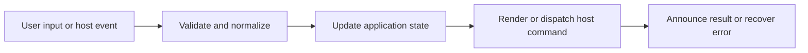

# Code Blocks, Syntax, Line Interaction, and Copy

## Feature intent

Specify fenced-code rendering, syntax highlighting, line numbers, line/range interaction, collapse, copy behavior, and HTML block preview controls.

## Capability contract

| Capability | Required behavior | User result |
|---|---|---|
| Syntax highlighting | Map language aliases and apply token rules. | Code is readable. |
| Line numbers | Render optional line metadata without polluting copied text. | References are easy. |
| Line selection | Select one line or ranges by interaction. | Readers can focus/copy relevant code. |
| Collapse | Reduce long blocks while preserving header/actions. | Documents stay compact. |
| Copy | Copy canonical code or selected range with feedback. | Content is reusable. |
| HTML block preview | Switch source/preview under security rules. | Examples can be seen and inspected. |

## Interaction and processing flow



### Interaction rules

- Copy text comes from canonical code data, not highlighted token markup.
- Line-number labels are excluded from text extraction and in-document find.
- Handler registration is idempotent after enhancement retries/rerenders.
- Selection state is local to the code block.
- HTML code preview uses the same sandbox baseline as document HTML preview.


## States and failure behavior

| State | Required presentation | Exit condition |
|---|---|---|
| Expanded | All code visible | Collapse |
| Collapsed | Header/summary visible | Expand |
| Copied | Temporary success label | Timer/reset |
| Copy failed | Failure feedback | Retry |
| HTML source/preview | Selected mode visible | Toggle |

## Runtime behavior

| Runtime | Specification |
|---|---|
| All | Shared code renderer/handlers. |
| VS Code | Maintains highlighter/renderer parity. |
| Hosts | Clipboard may use bridge-specific implementation. |

## Non-functional requirements

- All actions remain keyboard reachable.
- A failed enhancement must not prevent the base document from rendering.
- Host-facing inputs are validated before filesystem, shell, or network access.


## Acceptance criteria

- [ ] Copied code excludes line numbers and controls.
- [ ] Line/range interactions do not duplicate after rerender.
- [ ] Unknown language falls back to plain code.
- [ ] HTML preview cannot bypass sandbox restrictions.
## UI reference implementation

The sample shows the interaction boundary, not a replacement for the React implementation.

```html
<section class="spec-code-blocks-syntax-line-interaction-and-copy" aria-labelledby="code-blocks-syntax-line-interaction-and-copy-title">
  <h2 id="code-blocks-syntax-line-interaction-and-copy-title">Code Blocks, Syntax, Line Interaction, and Copy</h2>
  <p data-status role="status" aria-live="polite">Ready</p>
  <button type="button" data-action>Copy code</button>
</section>
```

```css
.spec-code-blocks-syntax-line-interaction-and-copy {
  display: grid;
  gap: 0.75rem;
  padding: 1rem;
  border: 1px solid var(--border);
  border-radius: var(--radius, 8px);
  background: var(--surface);
  color: var(--text);
}
.spec-code-blocks-syntax-line-interaction-and-copy button:focus-visible {
  outline: 2px solid var(--accent);
  outline-offset: 2px;
}
```

```javascript
const root = document.querySelector('.spec-code-blocks-syntax-line-interaction-and-copy');
const status = root.querySelector('[data-status]');
root.querySelector('[data-action]').addEventListener('click', () => {
  window.PlatformBridge.postMessage({ command: 'copyCode', text: 'const ready = true;' });
  status.textContent = 'Request sent';
});
```
## Source traceability

| Kind | Path | Purpose |
|---|---|---|
| Implementation | `ui/src/markdown/codeRenderer.ts` | Active behavior or contract |
| Implementation | `ui/src/markdown/highlighter.ts` | Active behavior or contract |
| Implementation | `ui/src/dom/codeLineHandlers.ts` | Active behavior or contract |
| Implementation | `ui/src/dom/copyHandlers.ts` | Active behavior or contract |
| Implementation | `ui/src/dom/htmlPreviewActions.ts` | Active behavior or contract |
| Verification | `tests/unit/ui/markdown/codeRenderer.test.ts` | Automated expectation |
| Verification | `tests/unit/ui/markdown/highlighter.test.ts` | Automated expectation |
| Verification | `tests/unit/ui/dom/codeLineHandlers.test.ts` | Automated expectation |
| Verification | `tests/unit/ui/dom/copyHandlers.test.ts` | Automated expectation |

---

[← TOC, Heading Sections, and Navigation History](06-toc-heading-sections-history.md) · [Documentation index](../README.md) · [Tables, Filters, Sorting, and Charts →](08-tables-filters-charts.md)
