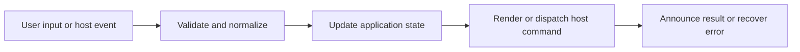

# Tables, Filters, Sorting, and Charts

## Feature intent

Define table parsing, column visibility management, and every enhanced interaction for Markdown, delimited text, CSV preview, converted spreadsheets, and rich chart visualizations.

## Capability contract

| Capability | Required behavior | User result |
|---|---|---|
| Parsing | Support pipe, comma, tab, and semicolon data with header modes. | Structured data is recognized. |
| Warnings | Explain inconsistent rows or malformed syntax. | Users can fix sources. |
| Sort | Stable per-column ascending/descending/reset behavior. | Rows can be ordered. |
| Filter | Global and column multi-select filters. | Rows can be narrowed. |
| Wrap/width | Toggle wrapping and bounded column widths. | Dense cells stay readable. |
| Column visibility | Per-table column toggle dropdown with switch buttons, show-all action, and last-column guard. | Columns can be hidden/shown on demand. |
| Collapse | Initially limit long tables and expand on demand. | Large documents load/read better. |
| Charts | Lazy-loaded suite of 9 visualizations (Bar, Horizontal Bar, Line, Area, Scatter, Radar, Polar Area, Pie, Doughnut). | Numeric data is visually graphed. |
| Chart Viewer | Fullscreen modal viewer with 50%–1000% continuous zoom, drag/touch pan, Fit, Reset, type switcher, and PNG export/copy. | In-depth chart inspection and sharing. |

## Interaction and processing flow

### Chart suite & data mapping

| Chart type | Minimum numeric columns | Data mapping rule |
|---|:---:|---|
| **Bar Chart** | 1 | Category labels on X-axis, numeric series columns on Y-axis. |
| **Horizontal Bar Chart** | 1 | Category labels on Y-axis, horizontal bars for series. |
| **Line Chart** | 1 | Continuous line trend with points across rows. |
| **Area Chart** | 1 | Filled semi-transparent area under series line. |
| **Scatter Chart** | 2 | First visible numeric column maps to X values; remaining numeric columns map to independent Y datasets. |
| **Radar Chart** | 1 | Circular multi-axis polygon overlay per series. |
| **Polar Area Chart** | 1 | Radial sector slices proportional to row values. |
| **Pie Chart** | 1 | Circular proportional slices for row data. |
| **Doughnut Chart** | 1 | Ring proportional slices with cutout center. |

### Chart modal viewer architecture

- **Continuous Scaling**: Zoom clamped between **50% and 1000%** with step zoom buttons, mouse wheel, and pinch gestures.
- **Pan Navigation**: Freeform panning via mouse drag and touch gestures with cursor state indicators (`grab` / `grabbing`).
- **Dual Canvas Isolation**: Fixed, scrollable legend canvas decoupled from the transformable plot canvas to preserve legend legibility while zooming and panning.
- **Dynamic Sizing**: Table view dropdown triggers size dynamically via an invisible offscreen sizer to fit the widest translated option label.
- **Export & Clipboard**: Full-resolution **Copy as Image** (raster PNG clipboard copy with font rendering) and **Save as Image (.PNG)** via native host save dialog on Tauri (`saveChartPng`) or standard browser download.

### Table limits and defaults

| Rule | Value |
|---|---:|
| Initial row collapse threshold | 15 rows |
| Suggested wrap width classes | roughly 10–28 characters |
| Line chart point hiding | more than 200 rows |
| Chart viewer scale limits | 50% to 1000% |
| Concurrent table enhancement tasks | up to 3 |

Chart instances are destroyed before replacement. Filtering, sorting, and column visibility toggles update table-derived chart data or reset chart state consistently.

## States and failure behavior

| State | Required presentation | Exit condition |
|---|---|---|
| Base table | Readable before enhancement | Enhance |
| Filtered/sorted | Derived row set | Reset/change |
| Columns hidden | Filtered columns hidden across header and body rows | Toggle/show all |
| Collapsed | Initial rows visible | Expand |
| Chart loading | Lazy library pending | Chart/table/error |
| Chart error | Table preserved | Retry/use table |
| Chart viewer modal | Fullscreen overlay with plot and toolbar | Close / Esc |

## Runtime behavior

| Runtime | Specification |
|---|---|
| All | Shared parser/renderer/handlers/viewer. |
| Tauri Desktop | Native `saveChartPng` command opens native OS file save dialog. |
| Chromium Extension | Delegated click handling in `useContentEffects` and `SearchDocumentPreview` bypasses MV3 CSP inline handler restrictions. |
| Converted spreadsheets | Use the same table UI and chart suite after conversion. |

## Non-functional requirements

- All actions remain keyboard reachable.
- A failed enhancement must not prevent the base document from rendering.
- Host-facing inputs are validated before filesystem, shell, or network access.
- Last-visible-column guard prevents hiding all columns in a table.

## Acceptance criteria

- [ ] All supported delimiters parse fixtures correctly.
- [ ] Filter, sort, and column visibility composition is deterministic.
- [ ] Chart error cannot disable table actions.
- [ ] Chart viewer supports zoom, pan, fit, type switching, copy, and PNG save.
- [ ] Enhancement handlers remain idempotent.

## Source traceability

| Kind | Path | Purpose |
|---|---|---|
| Implementation | `ui/src/markdown/delimitedText.ts` | Delimited text parser |
| Implementation | `ui/src/markdown/tableParser.ts` | Markdown table parser |
| Implementation | `ui/src/markdown/tableRenderer.ts` | Interactive table HTML renderer |
| Implementation | `ui/src/dom/tableHandlers.ts` | Core table interaction handlers |
| Implementation | `ui/src/dom/tableChartHandlers.ts` | Table chart bridge & switcher |
| Implementation | `ui/src/dom/tableChartConfig.ts` | Multi-type Chart.js configuration generator |
| Implementation | `ui/src/dom/tableChartViewer.ts` | Fullscreen chart modal viewer |
| Implementation | `ui/src/dom/tableChartViewerChart.ts` | Chart viewer plot rendering & pan/zoom |
| Implementation | `ui/src/dom/tableChartViewerLegend.ts` | Chart viewer fixed legend renderer |
| Implementation | `ui/src/dom/tableChartViews.ts` | Chart view eligibility & definitions |
| Implementation | `ui/src/dom/tableChartImageActions.ts` | Chart copy and save actions |
| Implementation | `ui/src/dom/tableColumnHandlers.ts` | Column visibility toggle handlers |
| Implementation | `ui/src/components/shared/SwitchButton.tsx` | Accessible switch button component |
| Implementation | `ui/src/components/Content/enhancements/tableEnhancement.ts` | Table DOM enhancement runner |
| Verification | `tests/fixtures/headerless.tsv` | TSV fixture |
| Verification | `tests/node/delimited-text.test.mjs` | Automated expectation |
| Verification | `tests/node/table-chart-types-contract.test.mjs` | Multi-type chart contract |
| Verification | `tests/node/table-columns-contract.test.mjs` | Column visibility menu contract |
| Verification | `tests/node/chart-modal-switch-native-save-contract.test.mjs` | Chart modal viewer & native save contract |
| Verification | `tests/unit/ui/dom/registerTableHandlers-comprehensive.test.ts` | Comprehensive handler tests |
| Verification | `tests/unit/ui/dom/tableHandlers-sort.test.ts` | Sorting unit tests |

---

[← Code Blocks, Syntax, Line Interaction, and Copy](07-code-blocks-and-copy.md) · [Documentation index](../README.md) · [Media, Mermaid, and Math Enhancements →](09-media-mermaid-math.md)

