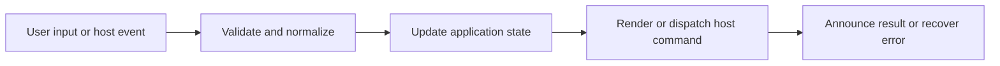

# Tables, Filters, Sorting, and Charts

## Feature intent

Define table parsing and every enhanced interaction for Markdown, delimited text, CSV preview, and converted spreadsheet content.

## Capability contract

| Capability | Required behavior | User result |
|---|---|---|
| Parsing | Support pipe, comma, tab, and semicolon data with header modes. | Structured data is recognized. |
| Warnings | Explain inconsistent rows or malformed syntax. | Users can fix sources. |
| Sort | Stable per-column ascending/descending/reset behavior. | Rows can be ordered. |
| Filter | Global and column multi-select filters. | Rows can be narrowed. |
| Wrap/width | Toggle wrapping and bounded column widths. | Dense cells stay readable. |
| Collapse | Initially limit long tables and expand on demand. | Large documents load/read better. |
| Charts | Lazy bar/line/pie-doughnut views for eligible data. | Patterns become visual. |

## Interaction and processing flow



### Table limits and defaults

| Rule | Value |
|---|---:|
| Initial row collapse threshold | 15 rows |
| Suggested wrap width classes | roughly 10–28 characters |
| Line chart point hiding | more than 200 rows |
| Concurrent table enhancement tasks | up to 3 |

Chart instances are destroyed before replacement. Filtering and sorting update table-derived chart data or reset chart state consistently.


## States and failure behavior

| State | Required presentation | Exit condition |
|---|---|---|
| Base table | Readable before enhancement | Enhance |
| Filtered/sorted | Derived row set | Reset/change |
| Collapsed | Initial rows visible | Expand |
| Chart loading | Lazy library pending | Chart/table/error |
| Chart error | Table preserved | Retry/use table |

## Runtime behavior

| Runtime | Specification |
|---|---|
| All | Shared parser/renderer/handlers. |
| Converted spreadsheets | Use the same table UI after conversion. |

## Non-functional requirements

- All actions remain keyboard reachable.
- A failed enhancement must not prevent the base document from rendering.
- Host-facing inputs are validated before filesystem, shell, or network access.


## Acceptance criteria

- [ ] All supported delimiters parse fixtures correctly.
- [ ] Filter and sort composition is deterministic.
- [ ] Chart error cannot disable table actions.
- [ ] Enhancement handlers remain idempotent.
## UI reference implementation

The sample shows the interaction boundary, not a replacement for the React implementation.

```html
<section class="spec-tables-filters-sorting-and-charts" aria-labelledby="tables-filters-sorting-and-charts-title">
  <h2 id="tables-filters-sorting-and-charts-title">Tables, Filters, Sorting, and Charts</h2>
  <p data-status role="status" aria-live="polite">Ready</p>
  <button type="button" data-action>Open document</button>
</section>
```

```css
.spec-tables-filters-sorting-and-charts {
  display: grid;
  gap: 0.75rem;
  padding: 1rem;
  border: 1px solid var(--border);
  border-radius: var(--radius, 8px);
  background: var(--surface);
  color: var(--text);
}
.spec-tables-filters-sorting-and-charts button:focus-visible {
  outline: 2px solid var(--accent);
  outline-offset: 2px;
}
```

```javascript
const root = document.querySelector('.spec-tables-filters-sorting-and-charts');
const status = root.querySelector('[data-status]');
root.querySelector('[data-action]').addEventListener('click', () => {
  window.PlatformBridge.postMessage({ command: 'navigate', path: '/project/docs/guide.md' });
  status.textContent = 'Request sent';
});
```
## Source traceability

| Kind | Path | Purpose |
|---|---|---|
| Implementation | `ui/src/markdown/delimitedText.ts` | Active behavior or contract |
| Implementation | `ui/src/markdown/tableParser.ts` | Active behavior or contract |
| Implementation | `ui/src/markdown/tableRenderer.ts` | Active behavior or contract |
| Implementation | `ui/src/dom/tableHandlers.ts` | Active behavior or contract |
| Implementation | `ui/src/dom/tableChartHandlers.ts` | Active behavior or contract |
| Implementation | `ui/src/components/Content/enhancements/tableEnhancement.ts` | Active behavior or contract |
| Verification | `tests/fixtures/headerless.tsv` | Automated expectation |
| Verification | `tests/node/delimited-text.test.mjs` | Automated expectation |
| Verification | `tests/unit/ui/dom/registerTableHandlers-comprehensive.test.ts` | Automated expectation |
| Verification | `tests/unit/ui/dom/tableHandlers-sort.test.ts` | Automated expectation |

---

[← Code Blocks, Syntax, Line Interaction, and Copy](07-code-blocks-and-copy.md) · [Documentation index](../README.md) · [Media, Mermaid, and Math Enhancements →](09-media-mermaid-math.md)
