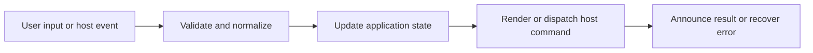

# Media, Mermaid, and Math Enhancements

## Feature intent

Specify post-render enhancement scheduling for images, gallery, video, YouTube, Mermaid, and mathematical notation.

## Capability contract

| Capability | Required behavior | User result |
|---|---|---|
| Images | Resolve local/remote image URLs and image-only rows. | Screenshots render well. |
| Gallery | Open images and Mermaid SVG in zoomable modal. | Details can be inspected. |
| Video | Render supported local video types and controls. | Demos can play. |
| YouTube | Recognize supported URL variants and embed safely. | Tutorials are available. |
| Mermaid | Lazy render diagrams with bounded concurrency and errors. | Architecture/process diagrams appear. |
| Math | Lazy render display/inline math where marked. | Technical notation is readable. |

## Interaction and processing flow



### Enhancement scheduler

- Retry delays: 60, 180, 500, 1000, and 2000 ms.
- Mermaid concurrency: up to 2 tasks.
- A task records completion/failure so reruns do not duplicate output.
- Base document is committed before optional libraries load.

### Gallery controls

Zoom clamps to 0.25–20. Buttons adjust by 0.25; wheel adjusts approximately 0.15. Panning is enabled only when zoomed and must not trap keyboard focus.

- **Light/Dark Theme Toggle**: A dedicated SunIcon/MoonIcon button in the modal footer toolbar (between Reset Zoom and Copy) flips the global app theme. The re-render is a one-shot themed pass through `renderMermaidToSvg` that defers to a `queueMicrotask` so the parent `useAppStateEffects` theme-sync effect has applied `document.documentElement.dataset.theme` and the new CSS custom properties before the helper reads them via `getComputedStyle`. The re-render effect MUST NOT call `setZoom` / `setPan` — the override SVG swaps in place via `innerHTML` on the existing transform container, preserving `--zoom` / `--pan-x` / `--pan-y`.
- **Snapshot Preservation on Initial Open**: The themed re-render effect skips the first dep-change for each NEW gallery open (tracked via `prevGalleryRef`). `createMediaGallery` already captured the snapshot from the content body's fully-laid-out SVG, so overwriting it on the new gallery's first effect tick would flicker or regress when the off-DOM helper mis-sizes layout-sensitive kinds.
- **In-DOM Scratch Host**: `renderMermaidToSvg` appends its scratch `<div class="mermaid">` to a hidden off-screen host on `document.body` (`position: absolute; left: -9999px; visibility: hidden; aria-hidden: true`) before `mermaid.run()` and removes it via `finally`. A detached scratch node returns 0 for every `getBoundingClientRect` / `getComputedTextLength` measurement, producing degenerate SVGs for layout-sensitive kinds (sequence, packet, kanban, pie, quadrant, xychart, zenuml, sankey) — visible as an empty square box until the user triggers a zoom/pan.


### Responsive Mermaid Viewport Fitting and Quality Polish

Mermaid diagrams render with layout profiles tailored to each diagram family:
- **Container constraints**: Rendered diagram wrappers (`.mdn-mermaid-wrap`) cap height at `--mermaid-max-h: min(65vh, 720px)` and center-align diagrams with `object-fit: contain` so tall diagrams fit cleanly within the reading view without vertical overflow.
- **Sequence diagrams**: Preserve Mermaid's computed layout geometry (`fitSequenceSvg`) and style all actors, lifelines, message text, and loop annotations with high contrast `var(--tx)` theme tokens.
- **Architecture diagrams**: Apply adaptive fillet curvature (`curveArchitectureEdgePath`) to turn sharp polyline waypoints into smooth curves, pad bounding group rectangles with rounded corners (`rx: 8px`), and render high-contrast centered service labels with surface halos.
- **ER diagrams**: Apply theme-aware zebra striping using surface and canvas background tokens (`rowOdd` / `rowEven`), clean table borders, and high-contrast typography bound to `var(--tx)`.
- **Gantt charts**: Render non-working day and weekend exclusions ("candles") with dark-mode friendly translucent tint (`excludeBkgColor`), readable task labels, and adaptive intrinsic width with horizontal body scrolling.
- **Block & C4 diagrams**: Use 1.5× expanded node and rank spacing (`nodeSpacing: 75`, `rankSpacing: 75`) to prevent edge overlaps.
- **Image & Diagram Copying**: Context menu and toolbar actions support copying rendered Mermaid diagrams directly as raster PNG images to the clipboard with full font embedding.

When the SVG graphics API exposes finite content bounds, standard flowchart and state diagrams tighten their `viewBox` with controlled padding. Sequence, Architecture, ZenUML, and Sankey diagrams preserve their native calculated canvas coordinate systems. Diagrams can be clicked to open in the full-featured Media Modal viewer with pan and zoom.

## States and failure behavior

| State | Required presentation | Exit condition |
|---|---|---|
| Placeholder | Base markup present | Enhance |
| Loading | Library/media pending | Ready/error |
| Ready | Interactive output | Modal/playback |
| Error | Item-level fallback | Retry/reopen |
| Gallery | Current item + transform | Navigate/close |

## Runtime behavior

| Runtime | Specification |
|---|---|
| All | Shared enhancement scheduler and modal. |
| Tauri | Local protocol enforces workspace containment/ranges. |
| Electron | YouTube headers/local path handling are host-specific. |
| Browser | Browser media policy and handle URLs apply. |

## Non-functional requirements

- All actions remain keyboard reachable.
- A failed enhancement must not prevent the base document from rendering.
- Host-facing inputs are validated before filesystem, shell, or network access.


## Acceptance criteria

- [ ] Base content renders before enhancement libraries.
- [ ] Mermaid/math failure is item-local.
- [ ] Gallery zoom/pan bounds hold.
- [ ] Re-running enhancements does not duplicate SVG/canvas/listeners.
## UI reference implementation

The sample shows the interaction boundary, not a replacement for the React implementation.

```html
<section class="spec-media-mermaid-and-math-enhancements" aria-labelledby="media-mermaid-and-math-enhancements-title">
  <h2 id="media-mermaid-and-math-enhancements-title">Media, Mermaid, and Math Enhancements</h2>
  <p data-status role="status" aria-live="polite">Ready</p>
  <button type="button" data-action>Open document</button>
</section>
```

```css
.spec-media-mermaid-and-math-enhancements {
  display: grid;
  gap: 0.75rem;
  padding: 1rem;
  border: 1px solid var(--border);
  border-radius: var(--radius, 8px);
  background: var(--surface);
  color: var(--text);
}
.spec-media-mermaid-and-math-enhancements button:focus-visible {
  outline: 2px solid var(--accent);
  outline-offset: 2px;
}
```

```javascript
const root = document.querySelector('.spec-media-mermaid-and-math-enhancements');
const status = root.querySelector('[data-status]');
root.querySelector('[data-action]').addEventListener('click', () => {
  window.PlatformBridge.postMessage({ command: 'navigate', path: '/project/docs/guide.md' });
  status.textContent = 'Request sent';
});
```
## Source traceability

| Kind | Path | Purpose |
|---|---|---|
| Implementation | `ui/src/components/Content/scheduleContentEnhancements.ts` | Active behavior or contract |
| Implementation | `ui/src/components/Content/enhancements/mermaidRendering.ts` | Active behavior or contract |
| Implementation | `ui/src/components/Content/enhancements/mathRendering.ts` | Active behavior or contract |
| Implementation | `ui/src/components/Modal/MediaModal.tsx` | Active behavior or contract |
| Implementation | `ui/src/markdown/mediaUrls.ts` | Active behavior or contract |
| Verification | `tests/node/content-enhancement-scheduler.test.mjs` | Automated expectation |
| Verification | `tests/node/content-enhancements-idempotence.test.mjs` | Automated expectation |
| Verification | `tests/unit/ui/components/content-enhancements.test.ts` | Automated expectation |
| Verification | `tests/unit/ui/markdown/mediaUrls.test.ts` | Automated expectation |

---

[← Tables, Filters, Sorting, and Charts](08-tables-filters-charts.md) · [Documentation index](../README.md) · [HTML Preview and Standalone Browser Preview →](10-html-preview-and-browser.md)
