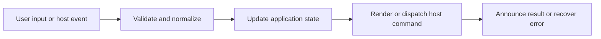

# Media, Mermaid, and Math Enhancements

## Feature intent

Specify post-render enhancement scheduling for images, gallery, video, YouTube, Mermaid, and mathematical notation.

## Capability contract

| Capability | Required behavior | User result |
|---|---|---|
| Images | Resolve local/remote image URLs and image-only rows. | Screenshots render well. |
| Gallery | Open images and Mermaid SVG in zoomable modal. | Details can be inspected. |
| Video | Render supported local video types and controls. | Demos can play. |
| YouTube | Recognize supported URL variants and embed safely. | Tutorials are available. |
| Mermaid | Lazy render diagrams with bounded concurrency and errors. | Architecture/process diagrams appear. |
| Math | Lazy render display/inline math where marked. | Technical notation is readable. |

## Interaction and processing flow



### Enhancement scheduler

- Retry delays: 60, 180, 500, 1000, and 2000 ms.
- Mermaid concurrency: up to 2 tasks.
- A task records completion/failure so reruns do not duplicate output.
- Base document is committed before optional libraries load.

### Gallery controls

Zoom clamps to 0.25–20. Buttons adjust by 0.25; wheel adjusts approximately 0.15. Panning is enabled only when zoomed and must not trap keyboard focus.


### Compact Mermaid viewport fitting

Mermaid initializes with compact flowchart spacing (`nodeSpacing: 28`, `rankSpacing: 34`), linear connectors, and bounded diagram padding. After render, Markdown Explorer centers each diagram, tightens its SVG to the actual content bounds, and recalculates the intrinsic width/height from those fitted bounds while retaining `max-width: 100%` and `height: auto` for responsive scaling.

When the SVG graphics API exposes finite content bounds, the renderer tightens `viewBox` to those bounds plus controlled padding. If `getBBox()` is unavailable or throws, the generated Mermaid viewBox is preserved while responsive sizing is still applied. Diagrams are never cropped to force compactness; the existing media viewer remains the detailed zoom/pan path.

## States and failure behavior

| State | Required presentation | Exit condition |
|---|---|---|
| Placeholder | Base markup present | Enhance |
| Loading | Library/media pending | Ready/error |
| Ready | Interactive output | Modal/playback |
| Error | Item-level fallback | Retry/reopen |
| Gallery | Current item + transform | Navigate/close |

## Runtime behavior

| Runtime | Specification |
|---|---|
| All | Shared enhancement scheduler and modal. |
| Tauri | Local protocol enforces workspace containment/ranges. |
| Electron | YouTube headers/local path handling are host-specific. |
| Browser | Browser media policy and handle URLs apply. |

## Non-functional requirements

- All actions remain keyboard reachable.
- A failed enhancement must not prevent the base document from rendering.
- Host-facing inputs are validated before filesystem, shell, or network access.


## Acceptance criteria

- [ ] Base content renders before enhancement libraries.
- [ ] Mermaid/math failure is item-local.
- [ ] Gallery zoom/pan bounds hold.
- [ ] Re-running enhancements does not duplicate SVG/canvas/listeners.
## UI reference implementation

The sample shows the interaction boundary, not a replacement for the React implementation.

```html
<section class="spec-media-mermaid-and-math-enhancements" aria-labelledby="media-mermaid-and-math-enhancements-title">
  <h2 id="media-mermaid-and-math-enhancements-title">Media, Mermaid, and Math Enhancements</h2>
  <p data-status role="status" aria-live="polite">Ready</p>
  <button type="button" data-action>Open document</button>
</section>
```

```css
.spec-media-mermaid-and-math-enhancements {
  display: grid;
  gap: 0.75rem;
  padding: 1rem;
  border: 1px solid var(--border);
  border-radius: var(--radius, 8px);
  background: var(--surface);
  color: var(--text);
}
.spec-media-mermaid-and-math-enhancements button:focus-visible {
  outline: 2px solid var(--accent);
  outline-offset: 2px;
}
```

```javascript
const root = document.querySelector('.spec-media-mermaid-and-math-enhancements');
const status = root.querySelector('[data-status]');
root.querySelector('[data-action]').addEventListener('click', () => {
  window.PlatformBridge.postMessage({ command: 'navigate', path: '/project/docs/guide.md' });
  status.textContent = 'Request sent';
});
```
## Source traceability

| Kind | Path | Purpose |
|---|---|---|
| Implementation | `ui/src/components/Content/scheduleContentEnhancements.ts` | Active behavior or contract |
| Implementation | `ui/src/components/Content/enhancements/mermaidRendering.ts` | Active behavior or contract |
| Implementation | `ui/src/components/Content/enhancements/mathRendering.ts` | Active behavior or contract |
| Implementation | `ui/src/components/Modal/MediaModal.tsx` | Active behavior or contract |
| Implementation | `ui/src/markdown/mediaUrls.ts` | Active behavior or contract |
| Verification | `tests/node/content-enhancement-scheduler.test.mjs` | Automated expectation |
| Verification | `tests/node/content-enhancements-idempotence.test.mjs` | Automated expectation |
| Verification | `tests/unit/ui/components/content-enhancements.test.ts` | Automated expectation |
| Verification | `tests/unit/ui/markdown/mediaUrls.test.ts` | Automated expectation |

---

[← Tables, Filters, Sorting, and Charts](08-tables-filters-charts.md) · [Documentation index](../README.md) · [HTML Preview and Standalone Browser Preview →](10-html-preview-and-browser.md)
