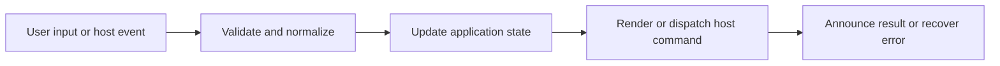

# HTML Preview and Standalone Browser Preview

## Feature intent

Define source/preview choices, local-first asset inlining, sandbox/CSP restrictions, resource bridge, and preview server lifecycle.

## Capability contract

| Capability | Required behavior | User result |
|---|---|---|
| Document preview | Toggle `.html` source and rendered sandbox. | HTML files are inspectable. |
| Code-block preview | Preview fenced HTML examples. | Examples are demonstrable. |
| Local resources | Inline validated CSS/JS and recursive CSS imports. | Workspace prototypes work offline. |
| Network blocking | Disable active remote APIs and CSP connections. | Preview cannot exfiltrate through active code. |
| Standalone preview | Open bounded host-served preview when supported. | User can inspect in a separate browser/window. |

## Interaction and processing flow



### Security contract

```html
<iframe sandbox="allow-scripts allow-forms" referrerpolicy="no-referrer"></iframe>
```

Never add `allow-same-origin`. CSP denies by default and blocks `connect-src`, frames, workers, objects, base URL, and form targets. Local CSS/JS requests use `readWorkspaceTextResource` and must remain within the active workspace.

### Host preview lifecycle

Standalone previews cap the document near 8 MiB, use heartbeat/idle cleanup around two minutes, enforce a maximum lifetime around 24 hours, and clean stale sessions periodically.


## States and failure behavior

| State | Required presentation | Exit condition |
|---|---|---|
| Source | Escaped code visible | Preview |
| Preparing | Resources pending | Preview/error |
| Sandbox preview | Restricted iframe visible | Source/open standalone |
| Resource warning | Partial preview | Fix/retry |
| Standalone active | Host session tracked | Close/expire |

## Runtime behavior

| Runtime | Specification |
|---|---|
| Electron/VS Code/Tauri | Standalone preview implementation available according to host. |
| Chromium/Website | In-page sandbox only or browser-owned behavior. |

## Non-functional requirements

- All actions remain keyboard reachable.
- A failed enhancement must not prevent the base document from rendering.
- Host-facing inputs are validated before filesystem, shell, or network access.


## Acceptance criteria

- [ ] No same-origin sandbox permission exists.
- [ ] Outside-workspace text resources are rejected.
- [ ] Blocked network APIs remain blocked inside preview.
- [ ] Preview sessions are bounded and cleaned.
## UI reference implementation

The sample shows the interaction boundary, not a replacement for the React implementation.

```html
<section class="spec-html-preview-and-standalone-browser-preview" aria-labelledby="html-preview-and-standalone-browser-preview-title">
  <h2 id="html-preview-and-standalone-browser-preview-title">HTML Preview and Standalone Browser Preview</h2>
  <p data-status role="status" aria-live="polite">Ready</p>
  <button type="button" data-action>Open HTML preview</button>
</section>
```

```css
.spec-html-preview-and-standalone-browser-preview {
  display: grid;
  gap: 0.75rem;
  padding: 1rem;
  border: 1px solid var(--border);
  border-radius: var(--radius, 8px);
  background: var(--surface);
  color: var(--text);
}
.spec-html-preview-and-standalone-browser-preview button:focus-visible {
  outline: 2px solid var(--accent);
  outline-offset: 2px;
}
```

```javascript
const root = document.querySelector('.spec-html-preview-and-standalone-browser-preview');
const status = root.querySelector('[data-status]');
root.querySelector('[data-action]').addEventListener('click', () => {
  window.PlatformBridge.postMessage({ command: 'openHtmlPreview', documentHtml: '<!doctype html><html><body><h1>Preview</h1></body></html>' });
  status.textContent = 'Request sent';
});
```
## Source traceability

| Kind | Path | Purpose |
|---|---|---|
| Implementation | `ui/src/markdown/htmlLocalFirstPreview.ts` | Active behavior or contract |
| Implementation | `ui/src/markdown/htmlPreviewDocument.ts` | Active behavior or contract |
| Implementation | `ui/src/components/Modal/HtmlPreviewModal.tsx` | Active behavior or contract |
| Implementation | `electron/core/html-preview-server.js` | Active behavior or contract |
| Implementation | `vscode/src/core/htmlPreviewServer.ts` | Active behavior or contract |
| Implementation | `tauri/src/runtime/html_preview.rs` | Active behavior or contract |
| Verification | `tests/node/html-local-first-followup.test.mjs` | Automated expectation |
| Verification | `tests/node/html-preview-settings-security-followup.test.mjs` | Automated expectation |
| Verification | `tests/unit/electron/html-preview-server.test.ts` | Automated expectation |

---

[← Media, Mermaid, and Math Enhancements](09-media-mermaid-math.md) · [Documentation index](../README.md) · [Find, Workspace Search, and Cross-Tab Search →](11-search-system.md)
