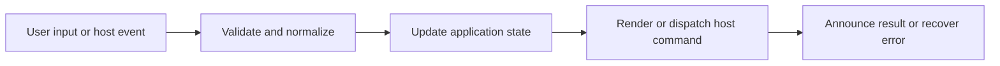

# Find, Workspace Search, and Cross-Tab Search

## Feature intent

Define the three distinct search modes, indexing boundaries, Unicode behavior, correlation, streaming, truncation, result navigation, and accessibility.

## Capability contract

| Capability | Required behavior | User result |
|---|---|---|
| Find in document | Search eligible rendered DOM text, optionally matching exact case, and wrap navigation. | Immediate current-page lookup. |
| Workspace search | Search title/name/path and bounded Markdown/text contents with one case toggle. | Repository lookup. |
| Cross-tab search | Stream case-aware results from open desktop workspace indexes. | Multi-project lookup. |
| Scoped search | Apply the active sidebar focus set to workspace search results and rerun when focus changes. | Unfocused files are excluded without clearing the query. |
| Result modal | Keep workspace checkboxes, result selection, and full rendered preview inside a bounded modal with two resizable separators. | Search context stays visible. |
| Preview mode | Default on; render the selected source and scroll to its result position. | Users inspect the complete file before opening it. |
| Result navigation | Preview-on uses the header arrow; preview-off uses tooltip row arrows, preserving the same case-aware match ordinal. | Search leads to exact context. |

## Interaction and processing flow



### Index/search limits

| Rule | Value |
|---|---:|
| Workspace items | maximum 10,000 |
| Content indexing | skip file bodies above 2 MiB |
| Electron cross-tab result default max | 2,000 |
| Electron index-prime batch | 5 |
| UI result page | 100 |

Find-in-document excludes interactive chrome, scripts/styles, iframe, SVG/canvas, line numbers, and table toolbar text. Search is case-insensitive by default. The single **Match case** toggle switches current-file, workspace, and cross-tab matching to exact casing. Cross-tab requests also carry the currently checked workspace tab IDs. Search responses and full-file preview responses must match their latest request IDs.


## States and failure behavior

| State | Required presentation | Exit condition |
|---|---|---|
| Closed | No overlay/panel | Open |
| Querying | Latest request active | Results/error/cancel |
| Results | Workspace checkbox filter, count/list, selection, and full-file preview | Resize, toggle Preview, arrow-open, or refine |
| No results | Explicit empty state | Refine |
| Truncated/cancelled | Status shown | Refine/retry |

## Runtime behavior

| Runtime | Specification |
|---|---|
| All | Shared overlay/result UI and DOM find. |
| Electron | Worker-backed cross-tab search. |
| Tauri/VS Code/Chromium/Website | Runtime-specific workspace index/search implementation. |

## Non-functional requirements

- All actions remain keyboard reachable.
- A failed enhancement must not prevent the base document from rendering.
- Host-facing inputs are validated before filesystem, shell, or network access.


## Acceptance criteria

- [ ] The three search modes do not mix scopes/results.
- [ ] Stale request results are ignored.
- [ ] Search controls and results are keyboard navigable.
- [ ] Result rows select only; Preview defaults on and positions the full rendered file at the target match.
- [ ] Preview-on hides row arrows and uses the header arrow; preview-off exposes tooltip row arrows.
- [ ] Every workspace checkbox defaults on and disabled tab IDs are excluded from host search.
- [ ] All three columns resize within modal limits without adding a result rail.
- [ ] All nine supported languages provide every new search label.
- [ ] Case sensitivity is consistent across shared UI and all runtime search implementations.
- [ ] Oversized files are metadata searchable without body indexing.
## UI reference implementation

The sample shows the interaction boundary, not a replacement for the React implementation.

```html
<section class="spec-find-workspace-search-and-cross-tab-search" aria-labelledby="find-workspace-search-and-cross-tab-search-title">
  <h2 id="find-workspace-search-and-cross-tab-search-title">Find, Workspace Search, and Cross-Tab Search</h2>
  <p data-status role="status" aria-live="polite">Ready</p>
  <button type="button" data-action>Search workspace</button>
</section>
```

```css
.spec-find-workspace-search-and-cross-tab-search {
  display: grid;
  gap: 0.75rem;
  padding: 1rem;
  border: 1px solid var(--border);
  border-radius: var(--radius, 8px);
  background: var(--surface);
  color: var(--text);
}
.spec-find-workspace-search-and-cross-tab-search button:focus-visible {
  outline: 2px solid var(--accent);
  outline-offset: 2px;
}
```

```javascript
const root = document.querySelector('.spec-find-workspace-search-and-cross-tab-search');
const status = root.querySelector('[data-status]');
root.querySelector('[data-action]').addEventListener('click', () => {
  window.PlatformBridge.postMessage({ command: 'searchWorkspace', requestId: crypto.randomUUID(), query: 'Architecture', matchCase: true, items: [] });
  status.textContent = 'Request sent';
});
```
## Focus-aware sidebar workspace search

The sidebar sends the normal host workspace-search request, then filters returned paths through the active focus set. A deterministic focus revision participates in the request effect dependency list. Therefore, changing focus with an existing two-or-more-character query reruns focus-aware search immediately and refreshes the visible result tree. Focus disabled means all host results remain eligible.

## Source traceability

| Kind | Path | Purpose |
|---|---|---|
| Implementation | `ui/src/components/Search/FindInFilePanel.tsx` | Active behavior or contract |
| Implementation | `ui/src/components/Search/SearchOverlay.tsx` | Search modal state and host orchestration |
| Implementation | `ui/src/components/Search/SearchOverlayWorkspaceList.tsx` | Workspace scope checkboxes |
| Implementation | `ui/src/components/Search/SearchOverlayResults.tsx` | Selection and open-arrow behavior |
| Implementation | `ui/src/components/Search/SearchDocumentPreview.tsx` | Full rendered preview and target positioning |
| Implementation | `ui/src/components/Search/useSearchOverlayResize.ts` | Bounded three-column resizing |
| Implementation | `ui/src/useAppSearchEffects.ts` | Active behavior or contract |
| Implementation | `electron/search/search-index.js` | Active behavior or contract |
| Implementation | `electron/search/search-worker-controller.js` | Active behavior or contract |
| Implementation | `tauri/src/search/index.rs` | Active behavior or contract |
| Implementation | `vscode/src/core/panelSearch.ts` | VS Code case-aware search |
| Implementation | `vscode/src/core/panelSearchPreview.ts` | VS Code full-file preview loading |
| Implementation | `chromium-xtension/src/search-index.ts` | Active behavior or contract |
| Verification | `tests/node/search-ui-contracts.test.mjs` | Dependency-light UI contracts |
| Verification | `tests/unit/ui/components/search-overlay-interaction.test.tsx` | Search modal interaction behavior |
| Verification | `tests/node/search-preview-runtime.test.mjs` | Electron preview allowlist behavior |
| Verification | `tests/node/search-preview-host-contracts.test.mjs` | Cross-host preview and tab-filter contracts |
| Verification | `tests/unit/vscode/panel-search-preview.test.ts` | VS Code preview source behavior |
| Verification | `tests/unit/electron/search-index.test.ts` | Automated expectation |
| Verification | `tests/unit/electron/search-worker-controller.test.ts` | Automated expectation |
| Verification | `tests/unit/chromium/search-index.test.ts` | Automated expectation |

---

[← HTML Preview and Standalone Browser Preview](10-html-preview-and-browser.md) · [Documentation index](../README.md) · [Settings, Preferences, and Import/Export →](12-settings-preferences-import-export.md)
