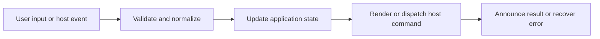

# Settings, Preferences, and Import/Export

## Feature intent

Define settings modal organization, preference behavior, validation, schema-versioned transfer, dialogs, and persistence.

## Capability contract

| Capability | Required behavior | User result |
|---|---|---|
| Preferences panel | Edit active `AppSettings` values. | Behavior is customizable. |
| Shortcut panel | Search, change, disable, and reset bindings. | Keyboard workflow is customizable. |
| Theme controls | Choose built-in/custom themes and remix. | Appearance is customizable. |
| Import/export | Transfer versioned validated settings. | Configuration is portable. |
| Dialogs/status | Explain destructive/reset/import outcomes. | Changes remain understandable. |

## Interaction and processing flow



### Update semantics

- Change only the targeted setting; preserve all other fields.
- Normalize before persistence and again when loading untrusted persisted/imported values.
- Capability-dependent settings are disabled/hidden rather than sending unsupported commands.
- Import is atomic: validate and normalize before applying any field.
- Export includes the complete serializable settings object.
- Active import restores core preferences, browsing scope, keybinding values, language, and custom themes; it currently preserves the existing `searchScopeFocus` and `disabledKeybindings` maps rather than importing them.
- **Maximum Pinned Items (`maxPinnedItems`)**: User preference to limit pinned items per workspace between `1` and `15` (default `10`). Rendered as a numeric input (`min={1} max={15}`) at the last position of the View Preferences section in `SettingsPreferencesPanel.tsx`. Fully localized across all 9 supported languages (`en`, `vi`, `fr`, `es`, `zh`, `no`, `ja`, `ko`, `ru`).

See the Settings Catalog and Storage Catalog for exact keys and limits.


## States and failure behavior

| State | Required presentation | Exit condition |
|---|---|---|
| Closed | No modal | Open |
| Preferences | Preference controls | Change/switch panel |
| Shortcuts | Search/list/editor | Save/reset |
| Dialog | Import/reset/delete confirmation | Confirm/cancel |
| Import error | Typed reason | Choose another file |

## Runtime behavior

| Runtime | Specification |
|---|---|
| All | Shared modal/schema. |
| Chromium | Conversion setting unavailable. |
| Desktop | Desktop view/shortcut controls apply. |
| VS Code | Host configuration may provide additional defaults. |

## Non-functional requirements

- All actions remain keyboard reachable.
- A failed enhancement must not prevent the base document from rendering.
- Host-facing inputs are validated before filesystem, shell, or network access.


## Acceptance criteria

- [ ] Every `AppSettings` key is represented by behavior or an explicit capability rule.
- [ ] Import errors are typed and atomic.
- [ ] Changing one setting preserves unrelated settings.
- [ ] Closing modal restores invoking focus.
## UI reference implementation

The sample shows the interaction boundary, not a replacement for the React implementation.

```html
<section class="spec-settings-preferences-and-import-export" aria-labelledby="settings-preferences-and-import-export-title">
  <h2 id="settings-preferences-and-import-export-title">Settings, Preferences, and Import/Export</h2>
  <p data-status role="status" aria-live="polite">Ready</p>
  <button type="button" data-action>Apply imported recents</button>
</section>
```

```css
.spec-settings-preferences-and-import-export {
  display: grid;
  gap: 0.75rem;
  padding: 1rem;
  border: 1px solid var(--border);
  border-radius: var(--radius, 8px);
  background: var(--surface);
  color: var(--text);
}
.spec-settings-preferences-and-import-export button:focus-visible {
  outline: 2px solid var(--accent);
  outline-offset: 2px;
}
```

```javascript
const root = document.querySelector('.spec-settings-preferences-and-import-export');
const status = root.querySelector('[data-status]');
root.querySelector('[data-action]').addEventListener('click', () => {
  window.PlatformBridge.postMessage({ command: 'replaceRecentWorkspaces', recentWorkspaces: [{ name: 'Docs', path: '/project/docs', lastOpened: Date.now() }] });
  status.textContent = 'Request sent';
});
```
## Source traceability

| Kind | Path | Purpose |
|---|---|---|
| Implementation | `ui/src/components/Settings/SettingsModal.tsx` | Active behavior or contract |
| Implementation | `ui/src/components/Settings/SettingsPreferencesPanel.tsx` | Active behavior or contract |
| Implementation | `ui/src/components/Settings/SettingsShortcutsPanel.tsx` | Active behavior or contract |
| Implementation | `ui/src/components/Settings/SettingsModalDialogs.tsx` | Active behavior or contract |
| Implementation | `ui/src/settings/settingsImportExport.ts` | Active behavior or contract |
| Verification | `tests/unit/ui/components/settings-modal-deep.test.tsx` | Automated expectation |
| Verification | `tests/unit/ui/settings-import-export.test.ts` | Automated expectation |
| Verification | `tests/unit/ui/components/settings-render.test.tsx` | Automated expectation |

---

[← Find, Workspace Search, and Cross-Tab Search](11-search-system.md) · [Documentation index](../README.md) · [Theme Modes, Styles, Pet Themes, and Custom Remix →](13-themes-custom-remix.md)
