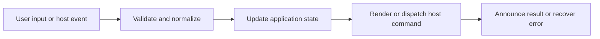

# Settings, Preferences, and Import/Export

## Feature intent

Define settings modal organization, preference behavior, validation, schema-versioned transfer, dialogs, and persistence.

## Capability contract

| Capability | Required behavior | User result |
|---|---|---|
| Preferences panel | Edit active `AppSettings` values. | Behavior is customizable. |
| Shortcut panel | Search, change, disable, and reset bindings. | Keyboard workflow is customizable. |
| Theme controls | Choose built-in/custom themes and remix. | Appearance is customizable. |
| Import/export | Transfer versioned validated settings. | Configuration is portable. |
| Dialogs/status | Explain destructive/reset/import outcomes. | Changes remain understandable. |

## Interaction and processing flow



### Update semantics

- Change only the targeted setting; preserve all other fields.
- Normalize before persistence and again when loading untrusted persisted/imported values.
- Capability-dependent settings are disabled/hidden rather than sending unsupported commands.
- Import is atomic: validate and normalize before applying any field.
- Export includes the complete serializable settings object.
- Active import restores core preferences, browsing scope, keybinding values, language, and custom themes; it currently preserves the existing `searchScopeFocus` and `disabledKeybindings` maps rather than importing them.
- **Maximum Pinned Items (`maxPinnedItems`)**: User preference to limit pinned items per workspace between `1` and `15` (default `10`). Rendered as a numeric input (`min={1} max={15}`) in the Appearance preference controls, without a separate **View Preferences** secondary heading, in `SettingsPreferencesPanel.tsx`. Fully localized across all 9 supported languages (`en`, `vi`, `fr`, `es`, `zh`, `no`, `ja`, `ko`, `ru`).

See the Settings Catalog and Storage Catalog for exact keys and limits.


### Host typography

Electron, Tauri, and VS Code expose the Typography section with independent **App UI**, **Body**, **Heading**, **Quote**, and **Code** bindings. `AppSettings.fontBindings` stores one normalized `DesktopFontBinding` per role. Each binding records the font source (`default`, `system`, or `imported`), family/import ID when needed, plus the explicitly selected `style` and numeric `weight`.

The family picker is a searchable keyboard-accessible dropdown grouped by System and Imported families. The variant/weight picker is also a custom keyboard-accessible listbox, uses only styles/weights supported by the selected family, and scrolls when its option set exceeds the visible menu limit. Variable fonts expose common in-range weights plus their discovered endpoints. Each row places **Import font file** to the left of an icon-only Reset action with a tooltip; Reset changes only that role. The Apply action uses the circle-check icon, remains disabled until the draft differs from persisted bindings, and opens a confirmation summary containing only the changed roles before persistence.

`listDesktopFonts` requests the normalized native catalog. Each `importDesktopFonts` action selects a **single `.ttf` or `.otf` file**, copies it into app-managed storage, and returns an `importedId` correlated by `requestId`. The renderer binds that imported family to the role that initiated the matching request **in the local typography draft only**; the user must still choose Apply to persist `fontBindings`. Imported files do not need to contain Regular, Bold, and Italic together. `removeImportedDesktopFont` removes the managed item and any persisted role using it falls back through normal settings validation. Import/export persists only normalized references and variants, never font binaries or original filesystem paths.

Legacy persisted `appFont` and `codeFont` references are accepted during migration and converted into `fontBindings`; new persistence writes `fontBindings`.

VS Code uses the same normalized font protocol as desktop: the extension host enumerates OS font files, stores imported fonts under extension global storage, converts managed paths with `asWebviewUri`, and grants those resources through the panel CSP/local-resource roots. Chromium/Web does not enumerate system fonts or import font binaries.

## States and failure behavior

| State | Required presentation | Exit condition |
|---|---|---|
| Closed | No modal | Open |
| Preferences | Preference controls | Change/switch panel |
| Shortcuts | Search/list/editor | Save/reset |
| Dialog | Import/reset/delete confirmation | Confirm/cancel |
| Import error | Typed reason | Choose another file |

## Runtime behavior

| Runtime | Specification |
|---|---|
| All | Shared modal/schema. |
| Chromium | Conversion setting unavailable. |
| Desktop | Desktop view/shortcut controls apply; installed and imported fonts are available. |
| VS Code | Installed system fonts and imported `.ttf`/`.otf` files customize Markdown Explorer only; VS Code editor fonts remain untouched. |

## Non-functional requirements

- All actions remain keyboard reachable.
- A failed enhancement must not prevent the base document from rendering.
- Host-facing inputs are validated before filesystem, shell, or network access.


## Acceptance criteria

- [ ] Every `AppSettings` key is represented by behavior or an explicit capability rule.
- [ ] Import errors are typed and atomic.
- [ ] Changing one setting preserves unrelated settings.
- [ ] Closing modal restores invoking focus.
## UI reference implementation

The sample shows the interaction boundary, not a replacement for the React implementation.

```html
<section class="spec-settings-preferences-and-import-export" aria-labelledby="settings-preferences-and-import-export-title">
  <h2 id="settings-preferences-and-import-export-title">Settings, Preferences, and Import/Export</h2>
  <p data-status role="status" aria-live="polite">Ready</p>
  <button type="button" data-action>Apply imported recents</button>
</section>
```

```css
.spec-settings-preferences-and-import-export {
  display: grid;
  gap: 0.75rem;
  padding: 1rem;
  border: 1px solid var(--border);
  border-radius: var(--radius, 8px);
  background: var(--surface);
  color: var(--text);
}
.spec-settings-preferences-and-import-export button:focus-visible {
  outline: 2px solid var(--accent);
  outline-offset: 2px;
}
```

```javascript
const root = document.querySelector('.spec-settings-preferences-and-import-export');
const status = root.querySelector('[data-status]');
root.querySelector('[data-action]').addEventListener('click', () => {
  window.PlatformBridge.postMessage({ command: 'replaceRecentWorkspaces', recentWorkspaces: [{ name: 'Docs', path: '/project/docs', lastOpened: Date.now() }] });
  status.textContent = 'Request sent';
});
```
## Source traceability

| Kind | Path | Purpose |
|---|---|---|
| Implementation | `ui/src/components/Settings/SettingsModal.tsx` | Active behavior or contract |
| Implementation | `ui/src/components/Settings/SettingsPreferencesPanel.tsx` | Active behavior or contract |
| Implementation | `ui/src/components/Settings/SettingsShortcutsPanel.tsx` | Active behavior or contract |
| Implementation | `ui/src/components/Settings/SettingsModalDialogs.tsx` | Active behavior or contract |
| Implementation | `ui/src/settings/settingsImportExport.ts` | Active behavior or contract |
| Verification | `tests/unit/ui/components/settings-modal-deep.test.tsx` | Automated expectation |
| Verification | `tests/unit/ui/settings-import-export.test.ts` | Automated expectation |
| Verification | `tests/unit/ui/components/settings-render.test.tsx` | Automated expectation |

---

[← Find, Workspace Search, and Cross-Tab Search](11-search-system.md) · [Documentation index](../README.md) · [Theme Modes, Styles, Pet Themes, and Custom Remix →](13-themes-custom-remix.md)

## Settings navigation

Settings is organized as a left navigation with one content pane: Appearance, Typography where supported, Theme Style, Keyboard Shortcuts, and Update & Backup. Every tab presents a title, description, and a section icon. Theme Style centers its theme controls in the content pane, while its menus remain trigger-anchored viewport-safe portals and show at most seven rows before scrolling. Typography keeps its title/description and Apply action fixed while only the font-role list scrolls. Its Import font file, Reset, and Remove actions share the same themed outline-button interaction used by update and JSON actions; imported fonts bind only to the initiating role draft until Apply. The Settings close tooltip renders `Esc` with the shared keycap presentation. Update & Backup owns manual update checks, changelog access, and JSON import/export, and Check for update reuses the Update & Backup cloud icon; the navigation version label also opens the GitHub changelog and exposes that behavior through a tooltip. An available non-skipped release shows an attention dot on Settings navigation and the More Actions/settings trigger.

## Editor action shortcuts

The **Edit current document** action is capability-gated by host. Electron/Tauri keep Edit inside More actions with default `Ctrl+E`. VS Code renders an icon-only Edit action immediately before More actions with default `Ctrl+Alt+E` (or the platform-equivalent command modifier shown by the UI). Chromium/Web exposes neither the Edit action nor an Edit shortcut. The VS Code Edit tooltip uses a viewport-level portal so shell/topbar overflow cannot clip it; tooltips still render the active binding with keycap styling, including user-remapped shortcuts.

## Update notification preference

Desktop users can receive an available-update dialog after the delayed startup check. The dialog uses the glow status icon, places View changelog in the header below the version status, and exposes Download update plus outline Later/Skip actions where the runtime owns installation. A skipped release version is persisted locally; only that exact normalized version is suppressed, so a later release can notify again. VS Code may check and report new versions, but it never renders Markdown Explorer-owned download/install controls because VS Code owns extension installation. Manual update checks remain available from Settings even when automatic notification for the current release was skipped.


## Localization synchronization

All Settings presentation strings, tooltips, ARIA labels, shortcut action labels, Typography confirmation copy, Theme Remix controls/statuses, and Update & Backup labels resolve through the nine-locale translation catalogs. User-visible shortcut names that do not map directly to `t.actions` (sidebar cursor mode, Reset zoom, and desktop tab-close actions) resolve through the shared localized shortcut-label helper rather than falling back to English. Brand names, command IDs, paths, URLs, and code remain literal.
