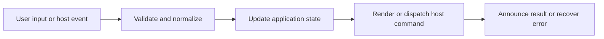

# Theme Modes, Styles, Pet Themes, and Custom Remix

## Feature intent

Define valid appearance values, CSS token application, style grouping, custom theme model, validation ranges, migration, and background handling.

## Capability contract

| Capability | Required behavior | User result |
|---|---|---|
| Mode | Auto, light, or dark. | Theme follows system or explicit choice. |
| Built-in style | Default, bento, vercel, Tokyo Night, neon voltage, raw grid, and pet styles. | Curated visual systems. |
| Custom remix | Override colors/layout/background from a valid base style. | Personal theme without arbitrary CSS. |
| Migration | Map retired values to supported equivalents. | Upgrades remain readable. |
| Validation | Clamp ranges and validate image data URL/MIME/size. | Theme data stays safe/bounded. |

## Interaction and processing flow



### Active styles

`default`, `bento`, `vercel`, `tokyo-night`, `neon-voltage`, `raw-grid`, `pet-white-shiba`, `pet-k-ink`, `pet-cat`, `pet-hamster`, `pet-corgi`.

`glass` stylesheets/tests do not make `glass` a valid current `ThemeStyle`. Unknown values normalize to `default`. Legacy `pet-shiba-memes` maps to `tokyo-night`; `pet-shiba` maps to `pet-white-shiba`.

### Custom limits

- Maximum 24 custom themes.
- ID ≤64 chars; name ≤48 chars.
- Background Data URL ≤900,000 chars; png/jpeg/webp/gif only.
- Radius 0–18; stroke 0–3; content padding 16–64; section gap 4–28.
- Background opacity 0–0.5; blur 0–18; position ≤48 chars.


## States and failure behavior

| State | Required presentation | Exit condition |
|---|---|---|
| Built-in | Mode/style active | Choose/remix |
| Editing remix | Validated draft preview | Save/cancel |
| Custom active | Custom ID + normalized theme | Edit/delete/fallback |
| Invalid persisted | Fallback default | Select valid theme |

## Runtime behavior

| Runtime | Specification |
|---|---|
| All | Shared token/style implementation. |
| Auto mode | Uses host/system color preference. |
| Background image | Local Data URL only; no arbitrary remote CSS. |

## Non-functional requirements

- All actions remain keyboard reachable.
- A failed enhancement must not prevent the base document from rendering.
- Host-facing inputs are validated before filesystem, shell, or network access.


## Acceptance criteria

- [ ] Only active style union values persist.
- [ ] All custom numeric fields stay in range.
- [ ] Oversized/unsupported background images are rejected.
- [ ] Legacy theme values migrate deterministically.
## UI reference implementation

The sample shows the interaction boundary, not a replacement for the React implementation.

```html
<section class="spec-theme-modes-styles-pet-themes-and-custom-remix" aria-labelledby="theme-modes-styles-pet-themes-and-custom-remix-title">
  <h2 id="theme-modes-styles-pet-themes-and-custom-remix-title">Theme Modes, Styles, Pet Themes, and Custom Remix</h2>
  <p data-status role="status" aria-live="polite">Ready</p>
  <button type="button" data-action>Apply appearance</button>
</section>
```

```css
.spec-theme-modes-styles-pet-themes-and-custom-remix {
  display: grid;
  gap: 0.75rem;
  padding: 1rem;
  border: 1px solid var(--border);
  border-radius: var(--radius, 8px);
  background: var(--surface);
  color: var(--text);
}
.spec-theme-modes-styles-pet-themes-and-custom-remix button:focus-visible {
  outline: 2px solid var(--accent);
  outline-offset: 2px;
}
```

```javascript
const root = document.querySelector('.spec-theme-modes-styles-pet-themes-and-custom-remix');
const status = root.querySelector('[data-status]');
root.querySelector('[data-action]').addEventListener('click', () => {
  window.PlatformBridge.postMessage({ command: 'updateAppearance', theme: 'dark', themeStyle: 'tokyo-night' });
  status.textContent = 'Request sent';
});
```
## Source traceability

| Kind | Path | Purpose |
|---|---|---|
| Implementation | `ui/src/themeTypes.ts` | Active behavior or contract |
| Implementation | `ui/src/theme/customThemes.ts` | Active behavior or contract |
| Implementation | `ui/src/components/Settings/ThemeStylePicker.tsx` | Active behavior or contract |
| Implementation | `ui/src/components/Settings/ThemeRemixModal.tsx` | Active behavior or contract |
| Implementation | `ui/src/styles/tokens.css` | Active behavior or contract |
| Verification | `tests/node/theme-grouping-and-styles.test.mjs` | Automated expectation |
| Verification | `tests/unit/ui/custom-themes.test.ts` | Automated expectation |
| Verification | `tests/unit/ui/components/theme-remix-interactions.test.tsx` | Automated expectation |

---

[← Settings, Preferences, and Import/Export](12-settings-preferences-import-export.md) · [Documentation index](../README.md) · [Keyboard, Accessibility, Focus, and Responsive Behavior →](14-keyboard-accessibility-responsive.md)
