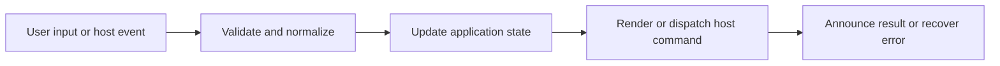

# Keyboard, Accessibility, Focus, and Responsive Behavior

## Feature intent

Specify effective shortcuts, semantic controls, focus lifecycle, status announcements, context-menu navigation, contrast/token use, and responsive shell behavior.

## Capability contract

| Capability | Required behavior | User result |
|---|---|---|
| Shortcuts | Resolve defaults, host overrides, customization, disable flags. | Power workflows remain fast. |
| Focus | Move/trap/restore focus for overlays and content transitions. | Keyboard context stays predictable. |
| Announcements | Use live regions for loading, search, copy, and errors. | Screen-reader users receive status. |
| Menus/tree/tabs | Expose keyboard navigation and semantic roles. | Complex widgets remain operable. |
| Responsive shell | Preserve primary controls at constrained sizes. | Small windows remain usable. |

## Interaction and processing flow



### Required focus behavior

| Event | Focus result |
|---|---|
| Open modal/search/find | Primary input or heading/control |
| Close overlay | Original invoking control when still present |
| Navigate to heading by keyboard | Heading or logical target where appropriate |
| Switch content/workspace tab | Active tab control/content shell according to action |
| Error/recovery dialog | Error heading or primary recovery action |

Do not intercept keystrokes owned by editable controls. Reject `Ctrl+Space` custom binding to protect IME behavior.


## States and failure behavior

| State | Required presentation | Exit condition |
|---|---|---|
| Pointer mode | No artificial focus movement | Keyboard action |
| Keyboard mode | Visible focus indicator | Continue/escape |
| Modal focus trap | Focus cycles inside | Close |
| Responsive collapsed panel | Toggle available | Expand |

## Runtime behavior

| Runtime | Specification |
|---|---|
| All | Shared semantic/focus/shortcut behavior. |
| Electron | Desktop-specific default bindings. |
| macOS | Command modifier normalization. |
| Browser/VS Code | Respect reserved host shortcuts. |

## Non-functional requirements

- All actions remain keyboard reachable.
- A failed enhancement must not prevent the base document from rendering.
- Host-facing inputs are validated before filesystem, shell, or network access.


## Acceptance criteria

- [ ] All primary actions are reachable without pointer.
- [ ] Focus never becomes trapped after modal closes.
- [ ] Status changes are announced without excessive repetition.
- [ ] Responsive collapse does not remove the only route to a feature.
## UI reference implementation

The sample shows the interaction boundary, not a replacement for the React implementation.

```html
<section class="spec-keyboard-accessibility-focus-and-responsive-behavior" aria-labelledby="keyboard-accessibility-focus-and-responsive-behavior-title">
  <h2 id="keyboard-accessibility-focus-and-responsive-behavior-title">Keyboard, Accessibility, Focus, and Responsive Behavior</h2>
  <p data-status role="status" aria-live="polite">Ready</p>
  <button type="button" data-action>Toggle fullscreen</button>
</section>
```

```css
.spec-keyboard-accessibility-focus-and-responsive-behavior {
  display: grid;
  gap: 0.75rem;
  padding: 1rem;
  border: 1px solid var(--border);
  border-radius: var(--radius, 8px);
  background: var(--surface);
  color: var(--text);
}
.spec-keyboard-accessibility-focus-and-responsive-behavior button:focus-visible {
  outline: 2px solid var(--accent);
  outline-offset: 2px;
}
```

```javascript
const root = document.querySelector('.spec-keyboard-accessibility-focus-and-responsive-behavior');
const status = root.querySelector('[data-status]');
root.querySelector('[data-action]').addEventListener('click', () => {
  window.PlatformBridge.postMessage({ command: 'toggle-fullscreen' });
  status.textContent = 'Request sent';
});
```
## Source traceability

| Kind | Path | Purpose |
|---|---|---|
| Implementation | `ui/src/hooks/useKeyboard.ts` | Active behavior or contract |
| Implementation | `ui/src/components/shared/TooltipButton.tsx` | Active behavior or contract |
| Implementation | `ui/src/components/Settings/SettingsModal.tsx` | Active behavior or contract |
| Implementation | `ui/src/components/Sidebar/useSidebarCursorNavigation.ts` | Active behavior or contract |
| Implementation | `ui/src/styles/global/global-settings-responsive.css` | Active behavior or contract |
| Verification | `tests/unit/ui/hooks/useKeyboard-integration.test.tsx` | Automated expectation |
| Verification | `tests/unit/ui/components/modal-render.test.tsx` | Automated expectation |
| Verification | `tests/unit/ui/components/sidebar-render.test.tsx` | Automated expectation |
| Verification | `tests/node/header-layout-contracts.test.mjs` | Automated expectation |

---

[← Theme Modes, Styles, Pet Themes, and Custom Remix](13-themes-custom-remix.md) · [Documentation index](../README.md) · [Localization, Welcome, Terms, and Onboarding →](15-localization-welcome-onboarding.md)
