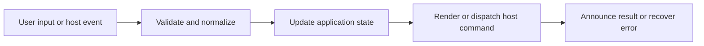

# Localization, Welcome, Terms, and Onboarding

## Feature intent

Define supported locales, translation fallback, welcome content, first-run terms acceptance, initial theme onboarding, and persistence.

## Capability contract

| Capability | Required behavior | User result |
|---|---|---|
| Localization | Translate application labels for nine supported languages. | UI is understandable to broader users. |
| Fallback | Use canonical English when key/locale is unavailable. | No blank labels. |
| Welcome | Features, searchable User manual, shortcuts, tips, and entry actions. | Tasks are discoverable without leaving the app. |
| Random Tip Card | Display a centered, shuffled tip card when all documents are closed. | Users discover features without opening a document. |
| Desktop App link | Welcome hero includes a Desktop App download hyperlink for web/browser users. | Browser users discover the native application. |
| Terms | Require first-run acknowledgement where configured. | Local-file/security expectations are visible. |
| Theme onboarding | Guide first visual selection once. | New users get a coherent appearance. |

## Interaction and processing flow



### Supported language codes

`en`, `vi`, `fr`, `es`, `zh`, `no`, `ja`, `ko`, `ru`.

### Renderer localization boundary

User-visible renderer copy must come from a typed translation domain. `auditedUiTranslations.ts` and `auditedUiTranslationTypes.ts` owns cross-cutting strings that were previously easy to strand in JSX: shell/Settings ARIA labels, Theme Remix controls and status feedback, Terms and onboarding copy, workspace-selection guidance, welcome cursor-mode instructions, generated Markdown table/code controls, chart/table switcher labels, video/YouTube fallback labels, initial loading/scanning text, sidebar navigation ARIA, copy feedback, and other shared presentation strings. `translations.ts` uses the English audited records for synchronous startup; `translationsData.ts` composes the matching audited record for every supported locale.

A whole-renderer audit treats literal product/brand names, command/action IDs, paths, URLs, source code, key names, protocol discriminants, and browser flag values as intentional technical literals. Everything else that can be presented to the user must be localized. Shortcut labels use a shared resolver so desktop-only tab actions, sidebar cursor mode, and Reset zoom never fall back to English in a non-English locale. The `rendererUi` audited domain is serialized into interactive table markup and passed through inline Markdown rendering so DOM handlers and generated video/YouTube controls continue using the active locale after filtering, wrapping, chart switching, row-count updates, and media fallback rendering. Recent-workspace time labels use locale-aware `Intl` formatters instead of English `ago` suffixes.

### Non-translatable data

Commands, settings keys, filesystem paths, URLs, code, source document content, and protocol discriminants remain exact. Translations apply only to application presentation strings.

First-run completion uses separate local-storage flags for terms acceptance and theme onboarding.


## User manual contract

- The second homepage tab is **User manual**.
- One local case-insensitive search filters progressive sections: Start here, Reading, Finding, Bookmarks, Customization, and Troubleshooting.
- Task cards may dispatch direct actions for workspace selection, Search, Bookmarks, and Settings.
- Effective shortcut labels come from current settings rather than hard-coded display text.
- Manual copy exists in `en`, `vi`, `fr`, `es`, `zh`, `no`, `ja`, `ko`, and `ru`.
- No-results state and all action labels are keyboard accessible and theme-driven.

## States and failure behavior

| State | Required presentation | Exit condition |
|---|---|---|
| First terms | Blocking acknowledgement | Accept |
| Theme onboarding | Style preview/finish | Complete |
| Welcome | Features/manual/shortcuts/tips/actions | Open workspace/document |
| Localized UI | Selected locale | Change/fallback |

## Runtime behavior

| Runtime | Specification |
|---|---|
| All | Shared translation/welcome/modals. |
| OS dialogs | Host/OS locale may differ from application locale. |

## Non-functional requirements

- All actions remain keyboard reachable.
- A failed enhancement must not prevent the base document from rendering.
- Host-facing inputs are validated before filesystem, shell, or network access.


## Acceptance criteria

- [x] All supported locale codes resolve core labels.
- [x] Theme Remix, Settings accessibility copy, workspace-selection guidance, Terms/onboarding, welcome cursor instructions, and shared shortcut labels resolve in all nine locales.
- [x] Renderer contract coverage rejects reintroduction of audited hard-coded English copy across React and generated Markdown/DOM surfaces.
- [x] Sidebar navigation, initial loading/scanning, recent-workspace timestamps, and video/YouTube fallback controls honor the selected locale.
- [ ] Missing translations fall back instead of blanking.
- [ ] Completed first-run steps do not repeat.
- [ ] Changing locale does not alter user document text.
- [x] The searchable User manual renders as the second tab with nine-locale copy and working direct actions.
## UI reference implementation

The sample shows the interaction boundary, not a replacement for the React implementation.

```html
<section class="spec-localization-welcome-terms-and-onboarding" aria-labelledby="localization-welcome-terms-and-onboarding-title">
  <h2 id="localization-welcome-terms-and-onboarding-title">Localization, Welcome, Terms, and Onboarding</h2>
  <p data-status role="status" aria-live="polite">Ready</p>
  <button type="button" data-action>Apply appearance</button>
</section>
```

```css
.spec-localization-welcome-terms-and-onboarding {
  display: grid;
  gap: 0.75rem;
  padding: 1rem;
  border: 1px solid var(--border);
  border-radius: var(--radius, 8px);
  background: var(--surface);
  color: var(--text);
}
.spec-localization-welcome-terms-and-onboarding button:focus-visible {
  outline: 2px solid var(--accent);
  outline-offset: 2px;
}
```

```javascript
const root = document.querySelector('.spec-localization-welcome-terms-and-onboarding');
const status = root.querySelector('[data-status]');
root.querySelector('[data-action]').addEventListener('click', () => {
  window.PlatformBridge.postMessage({ command: 'updateAppearance', theme: 'dark', themeStyle: 'tokyo-night' });
  status.textContent = 'Request sent';
});
```
## Source traceability

| Kind | Path | Purpose |
|---|---|---|
| Implementation | `ui/src/contexts/translationsData.ts` | Active behavior or contract |
| Implementation | `ui/src/markdown/inline.ts` | Locale-aware generated video/YouTube controls |
| Implementation | `ui/src/components/Workspace/workspaceSelectionUtils.ts` | Locale-aware recent-workspace timestamps |
| Implementation | `ui/src/contexts/welcomeTranslations.ts` | Existing welcome content |
| Implementation | `ui/src/contexts/userManualTranslations.ts` | User Manual translation model |
| Implementation | `ui/src/components/Content/UserManualTab.tsx` | Manual search and task cards |
| Implementation | `ui/src/components/Content/welcomeTipsContent.ts` | Active behavior or contract |
| Implementation | `ui/src/components/Content/welcomeTipGroups.ts` | Tip card content groups |
| Implementation | `ui/src/components/Content/welcomeLabels.ts` | Welcome page section labels |
| Implementation | `ui/src/components/Content/RandomTipCard.tsx` | Centered tip card for empty state |
| Implementation | `ui/src/components/Content/WelcomePage.tsx` | Welcome page layout and tabs |
| Implementation | `ui/src/components/Content/WelcomeHero.tsx` | Welcome hero with Desktop App link |
| Implementation | `ui/src/components/Content/WelcomePageIcons.tsx` | Welcome page section icons |
| Implementation | `ui/src/components/Modal/TermsModal.tsx` | Active behavior or contract |
| Implementation | `ui/src/components/Modal/ThemeOnboardingModal.tsx` | Active behavior or contract |
| Verification | `tests/unit/ui/contexts/translations.test.ts` | Automated expectation |
| Verification | `tests/unit/ui/components/welcome-render.test.tsx` | Automated expectation |
| Verification | `tests/node/theme-onboarding-dropdown-visibility.test.mjs` | Automated expectation |
| Verification | `tests/node/user-manual-home.test.mjs` | Manual placement, action, and localization contract |

---

[← Keyboard, Accessibility, Focus, and Responsive Behavior](14-keyboard-accessibility-responsive.md) · [Documentation index](../README.md) · [Document Conversion and Preview Quality →](16-document-conversion.md)
