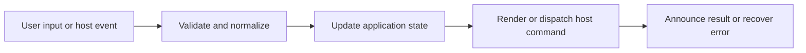

# Document Conversion and Preview Quality

## Feature intent

Define extension eligibility, opt-in scanning, converter routing, cache identity, preview metadata, format limits, and failure representations.

## Capability contract

| Capability | Required behavior | User result |
|---|---|---|
| Eligibility | Include explicit convertible extensions only when enabled. | Binary documents appear intentionally. |
| Routing | Select runtime converter by extension. | Supported formats receive preview. |
| Caching | Reuse conversion by mtime and size. | Repeated opens are faster. |
| Quality metadata | Report converted, legacy-best-effort, or conversion-failed. | Fidelity expectations are explicit. |
| Failure Markdown | Render readable explanation instead of empty content. | User can recover. |

## Interaction and processing flow



### Convertible extensions

`.doc`, `.docx`, `.pdf`, `.html`, `.xls`, `.xlsx`, `.xlm`, `.pptx`, `.odt`, `.odp`, `.ods`, `.rtf`.

### Preview metadata

`previewInfo.kind` is `converted` or `text`; it includes source extension/label and may include duration, cache flag, quality code, and warning.

Tauri native conversion bounds archive/XML members to 32 MiB. Chromium conversion is disabled.


## States and failure behavior

| State | Required presentation | Exit condition |
|---|---|---|
| Disabled | Convertible files excluded | Enable |
| Converting | Progress/loading | Preview/error |
| Cached preview | From-cache metadata | Source change |
| Best effort | Warning visible | Read/open source |
| Failed | Explanatory Markdown | Retry/open source |

## Runtime behavior

| Runtime | Specification |
|---|---|
| Electron/VS Code | `@the-long-ride/markdown-them` based path. |
| Tauri | Native Rust converter modules. |
| Chromium | Disabled. |
| Website | No native office conversion. |

## Non-functional requirements

- All actions remain keyboard reachable.
- A failed enhancement must not prevent the base document from rendering.
- Host-facing inputs are validated before filesystem, shell, or network access.


## Acceptance criteria

- [ ] Extension list is exact and conversion remains opt-in.
- [ ] Cache invalidates when size or modification time changes.
- [ ] Quality warning is visible for degraded/failure output.
- [ ] Converter failure cannot render blank UI.
## UI reference implementation

The sample shows the interaction boundary, not a replacement for the React implementation.

```html
<section class="spec-document-conversion-and-preview-quality" aria-labelledby="document-conversion-and-preview-quality-title">
  <h2 id="document-conversion-and-preview-quality-title">Document Conversion and Preview Quality</h2>
  <p data-status role="status" aria-live="polite">Ready</p>
  <button type="button" data-action>Enable conversion</button>
</section>
```

```css
.spec-document-conversion-and-preview-quality {
  display: grid;
  gap: 0.75rem;
  padding: 1rem;
  border: 1px solid var(--border);
  border-radius: var(--radius, 8px);
  background: var(--surface);
  color: var(--text);
}
.spec-document-conversion-and-preview-quality button:focus-visible {
  outline: 2px solid var(--accent);
  outline-offset: 2px;
}
```

```javascript
const root = document.querySelector('.spec-document-conversion-and-preview-quality');
const status = root.querySelector('[data-status]');
root.querySelector('[data-action]').addEventListener('click', () => {
  window.PlatformBridge.postMessage({ command: 'setDocumentConversion', enabled: true });
  status.textContent = 'Request sent';
});
```
## Source traceability

| Kind | Path | Purpose |
|---|---|---|
| Implementation | `electron/render/document-converter.js` | Active behavior or contract |
| Implementation | `vscode/src/core/documentConversion.ts` | Active behavior or contract |
| Implementation | `tauri/src/render/native_document_converter/mod.rs` | Active behavior or contract |
| Implementation | `tauri/src/workspace/file_types.rs` | Active behavior or contract |
| Implementation | `ui/src/types/content.ts` | Active behavior or contract |
| Verification | `tests/unit/electron/document-converter.test.ts` | Automated expectation |
| Verification | `tests/unit/vscode/documentConversion.test.ts` | Automated expectation |
| Verification | `tests/node/tauri-native-document-converter.test.mjs` | Automated expectation |

---

[← Localization, Welcome, Terms, and Onboarding](15-localization-welcome-onboarding.md) · [Documentation index](../README.md) · [Context Menus, Shell Locations, Links, and Editor Actions →](17-context-menus-shell-links.md)
