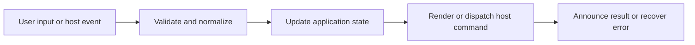

# Context Menus, Shell Locations, Links, and Editor Actions

## Feature intent

Define menu targets and actions, viewport placement, native path modes, internal/external link classification, dangerous scheme blocking, and editor integration.

## Capability contract

| Capability | Required behavior | User result |
|---|---|---|
| Sidebar menu | File/folder-specific open, reveal, copy, scope actions. | Navigation operations are close to target. |
| Content-tab menu | Close current/others/right/all and file actions. | Tabs are manageable. |
| Workspace-tab menu | Alias/close/reveal operations. | Desktop workspaces are manageable. |
| Link menu | Open/copy/internal/external actions, plus **Open as scope** to inspect document in modal Scope View. | Links are inspectable without losing context. |
| Toolbar menu | Overflow actions remain available on narrow layouts. | Responsive UI keeps functionality. |
| Shell/editor | Use typed path mode (`open-directory`, `reveal-file`, `open-parent-directory`) or structured external open (`file`, `folder`, `file-with-parent-workspace`). | Privileged behavior remains bounded. |

## Interaction and processing flow



### Shell location modes

| Mode | Use |
|---|---|
| `open-directory` | Open target directory |
| `reveal-file` | Select a file in Finder/File Explorer/File Manager |
| `open-parent-directory` | Open parent when reveal is unavailable/unsuitable |
| `file-with-parent-workspace` | External open: activate parent folder as workspace and focus target file |

Menus close before action execution, remain inside viewport, support Escape/outside dismissal, and restore focus where practical. Links with dangerous schemes are blocked before host dispatch.


## States and failure behavior

| State | Required presentation | Exit condition |
|---|---|---|
| Closed | No menu | Context action |
| Open | Typed target/actions | Select/dismiss |
| Unsupported action | Hidden/disabled | Capability change |
| Host action pending | Optional status | Complete/error |

## Runtime behavior

| Runtime | Specification |
|---|---|
| Electron/Tauri | Native file manager/browser. |
| VS Code | Editor/reveal through extension APIs. |
| Chromium/Website | Native path menu items absent; safe browser/copy actions remain. |

## Non-functional requirements

- All actions remain keyboard reachable.
- A failed enhancement must not prevent the base document from rendering.
- Host-facing inputs are validated before filesystem, shell, or network access.


## Acceptance criteria

- [ ] Menus are viewport-clamped and keyboard dismissible.
- [ ] Shell mode matches target type.
- [ ] Dangerous schemes never produce `openExternal`.
- [ ] Unsupported host actions are not presented as working.
## UI reference implementation

The sample shows the interaction boundary, not a replacement for the React implementation.

```html
<section class="spec-context-menus-shell-locations-links-and-editor-actions" aria-labelledby="context-menus-shell-locations-links-and-editor-actions-title">
  <h2 id="context-menus-shell-locations-links-and-editor-actions-title">Context Menus, Shell Locations, Links, and Editor Actions</h2>
  <p data-status role="status" aria-live="polite">Ready</p>
  <button type="button" data-action>Reveal in file manager</button>
</section>
```

```css
.spec-context-menus-shell-locations-links-and-editor-actions {
  display: grid;
  gap: 0.75rem;
  padding: 1rem;
  border: 1px solid var(--border);
  border-radius: var(--radius, 8px);
  background: var(--surface);
  color: var(--text);
}
.spec-context-menus-shell-locations-links-and-editor-actions button:focus-visible {
  outline: 2px solid var(--accent);
  outline-offset: 2px;
}
```

```javascript
const root = document.querySelector('.spec-context-menus-shell-locations-links-and-editor-actions');
const status = root.querySelector('[data-status]');
root.querySelector('[data-action]').addEventListener('click', () => {
  window.PlatformBridge.postMessage({ command: 'openShellLocation', path: '/project/docs/guide.md', mode: 'reveal-file' });
  status.textContent = 'Request sent';
});
```
## Source traceability

| Kind | Path | Purpose |
|---|---|---|
| Implementation | `ui/src/components/Sidebar/SidebarItemMenu.tsx` | Active behavior or contract |
| Implementation | `ui/src/components/shared/LinkContextMenu.tsx` | Active behavior or contract |
| Implementation | `ui/src/components/shared/TabContextMenu.tsx` | Active behavior or contract |
| Implementation | `ui/src/components/shared/ToolbarActionMenu.tsx` | Active behavior or contract |
| Implementation | `ui/src/desktop/shellLocation.ts` | Active behavior or contract |
| Implementation | `ui/src/dom/linkContextMenu.ts` | Active behavior or contract |
| Verification | `tests/unit/ui/components/sidebar-item-menu.test.tsx` | Automated expectation |
| Verification | `tests/unit/ui/dom/linkContextMenu.test.ts` | Automated expectation |
| Verification | `tests/node/shell-location.test.mjs` | Automated expectation |

---

[← Document Conversion and Preview Quality](16-document-conversion.md) · [Documentation index](../README.md) · [Desktop Window, Tray, Startup, and Update Lifecycle →](18-window-tray-update-lifecycle.md)
