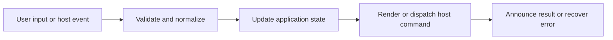

# Desktop Window, Tray, Startup, and Update Lifecycle

## Feature intent

Define single-instance startup, external-path queue, frameless controls, native window state, tray behavior, platform close lifecycle, and updater capability/state.

## Capability contract

| Capability | Required behavior | User result |
|---|---|---|
| Single instance | Focus existing app and queue new external targets. | One coherent process owns state. |
| Window controls | Minimize, maximize, close, fullscreen, zoom. | Frameless desktop remains controllable. |
| Tray | Open/focus and explicit Quit. | Desktop app can remain accessible. |
| Platform lifecycle | Apply macOS vs non-mac window-close behavior. | OS conventions are respected. |
| Updater | Gate download/schedule/apply by package capability. | Supported installations update safely. |

## Interaction and processing flow



### Electron lifecycle

- Acquire single-instance lock.
- Remove standard menu for frameless shell.
- Queue startup/external paths until UI readiness.
- Tray click/Open restores and focuses; Quit terminates.
- Non-macOS quits when all windows close; macOS remains and recreates on activate.
- In-app installation is limited to installed packaged Windows builds, excluding portable.

### Tauri window baseline

1280×800 default, 720×480 minimum, frameless, restored state, single-instance/file-drop integration, and configured updater support only when deployment keys/endpoints are valid.


## States and failure behavior

| State | Required presentation | Exit condition |
|---|---|---|
| Starting | Single-instance/startup target | Ready/error |
| Visible | Window active | Minimize/hide/close |
| Tray-only | Process active/window hidden | Open/Quit |
| Fullscreen/maximized | Host state emitted | Restore |
| Update states | Idle through error | Download/schedule/apply |

## Runtime behavior

| Runtime | Specification |
|---|---|
| Electron | Full lifecycle described above. |
| Tauri | Native window/local protocol/updater configuration. |
| Other hosts | Editor/browser distribution owns window/update lifecycle. |

## Non-functional requirements

- All actions remain keyboard reachable.
- A failed enhancement must not prevent the base document from rendering.
- Host-facing inputs are validated before filesystem, shell, or network access.


## Acceptance criteria

- [ ] Second-instance path reaches the existing ready UI exactly once.
- [ ] Tray Quit exits.
- [ ] Host events are authoritative for maximized/fullscreen UI.
- [ ] Unsupported builds hide installer controls.
## UI reference implementation

The sample shows the interaction boundary, not a replacement for the React implementation.

```html
<section class="spec-desktop-window-tray-startup-and-update-lifecycle" aria-labelledby="desktop-window-tray-startup-and-update-lifecycle-title">
  <h2 id="desktop-window-tray-startup-and-update-lifecycle-title">Desktop Window, Tray, Startup, and Update Lifecycle</h2>
  <p data-status role="status" aria-live="polite">Ready</p>
  <button type="button" data-action>Minimize window</button>
</section>
```

```css
.spec-desktop-window-tray-startup-and-update-lifecycle {
  display: grid;
  gap: 0.75rem;
  padding: 1rem;
  border: 1px solid var(--border);
  border-radius: var(--radius, 8px);
  background: var(--surface);
  color: var(--text);
}
.spec-desktop-window-tray-startup-and-update-lifecycle button:focus-visible {
  outline: 2px solid var(--accent);
  outline-offset: 2px;
}
```

```javascript
const root = document.querySelector('.spec-desktop-window-tray-startup-and-update-lifecycle');
const status = root.querySelector('[data-status]');
root.querySelector('[data-action]').addEventListener('click', () => {
  window.PlatformBridge.postMessage({ command: 'window-minimize' });
  status.textContent = 'Request sent';
});
```
## Source traceability

| Kind | Path | Purpose |
|---|---|---|
| Implementation | `electron/core/main-bootstrap.js` | Active behavior or contract |
| Implementation | `electron/core/startup-workspace.js` | Active behavior or contract |
| Implementation | `electron/window/window.js` | Active behavior or contract |
| Implementation | `electron/window/tray.js` | Active behavior or contract |
| Implementation | `electron/update/update-manager.js` | Active behavior or contract |
| Implementation | `tauri/tauri.conf.json` | Active behavior or contract |
| Implementation | `tauri/src/core/bootstrap.rs` | Active behavior or contract |
| Verification | `tests/unit/electron/main.test.ts` | Automated expectation |
| Verification | `tests/unit/electron/tray.test.ts` | Automated expectation |
| Verification | `tests/unit/electron/window.test.ts` | Automated expectation |
| Verification | `tests/node/packaged-runtime-contract.test.mjs` | Automated expectation |

---

[← Context Menus, Shell Locations, Links, and Editor Actions](17-context-menus-shell-links.md) · [Documentation index](../README.md) · [Errors, Recovery, Status, and Observability →](19-errors-recovery-observability.md)
