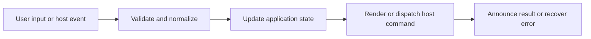

# Errors, Recovery, Status, and Observability

## Feature intent

Define local vs global failures, typed reasons, loading/progress status, stale response suppression, performance timing, debug tools, and cleanup.

## Capability contract

| Capability | Required behavior | User result |
|---|---|---|
| Typed recovery | Map missing, locked, resource, navigation, conversion, update reasons. | Users receive specific actions. |
| Local isolation | Keep base document when one enhancement fails. | Reading continues. |
| Status | Expose loading labels/details/progress and live announcements. | Asynchronous work is understandable. |
| Stale suppression | Discard mismatched operation/request results. | Old work cannot corrupt current state. |
| Observability | Use bounded timing/debug diagnostics without exposing secrets. | Developers can diagnose behavior. |

## Interaction and processing flow



### Failure containment hierarchy

1. Element enhancement failure: show local fallback.
2. Document/resource failure: preserve shell and other tabs.
3. Workspace failure: show selection/unavailable recovery.
4. Application-level failure: preserve a visible recovery path where the shell can still render.

Debug tools and performance timers are development/diagnostic aids; they do not define user behavior and must not log document secrets unnecessarily.


## States and failure behavior

| State | Required presentation | Exit condition |
|---|---|---|
| Loading | Label/detail/progress/cancel | Ready/error |
| Local error | Element/document fallback | Retry/dismiss |
| Workspace unavailable | Missing/locked action set | Reopen/select |
| Application failure | Visible recovery state where possible | Reload/restart |

## Runtime behavior

| Runtime | Specification |
|---|---|
| All | Shared presentation/correlation. |
| Electron/Tauri/VS Code | Host errors normalized into contracts. |
| Browser | Permission/handle failures normalized into recoverable state. |

## Non-functional requirements

- All actions remain keyboard reachable.
- A failed enhancement must not prevent the base document from rendering.
- Host-facing inputs are validated before filesystem, shell, or network access.


## Acceptance criteria

- [ ] Typed failures stay distinct.
- [ ] A local failure does not trigger global blank screen.
- [ ] Stale errors are ignored like stale success responses.
- [ ] Diagnostic output omits sensitive document content by default.
## UI reference implementation

The sample shows the interaction boundary, not a replacement for the React implementation.

```html
<section class="spec-errors-recovery-status-and-observability" aria-labelledby="errors-recovery-status-and-observability-title">
  <h2 id="errors-recovery-status-and-observability-title">Errors, Recovery, Status, and Observability</h2>
  <p data-status role="status" aria-live="polite">Ready</p>
  <button type="button" data-action>Refresh content</button>
</section>
```

```css
.spec-errors-recovery-status-and-observability {
  display: grid;
  gap: 0.75rem;
  padding: 1rem;
  border: 1px solid var(--border);
  border-radius: var(--radius, 8px);
  background: var(--surface);
  color: var(--text);
}
.spec-errors-recovery-status-and-observability button:focus-visible {
  outline: 2px solid var(--accent);
  outline-offset: 2px;
}
```

```javascript
const root = document.querySelector('.spec-errors-recovery-status-and-observability');
const status = root.querySelector('[data-status]');
root.querySelector('[data-action]').addEventListener('click', () => {
  window.PlatformBridge.postMessage({ command: 'refresh' });
  status.textContent = 'Request sent';
});
```
## Source traceability

| Kind | Path | Purpose |
|---|---|---|
| Implementation | `ui/src/App.tsx` | Active behavior or contract |
| Implementation | `ui/src/components/Content/scheduleContentEnhancements.ts` | Active behavior or contract |
| Implementation | `ui/src/contexts/appStateReducer.ts` | Active behavior or contract |
| Implementation | `electron/perf/perf-timer.js` | Active behavior or contract |
| Implementation | `electron/window/debug-tools.js` | Active behavior or contract |
| Implementation | `tauri/src/perf.rs` | Active behavior or contract |
| Implementation | `tauri/src/debug_tools.rs` | Active behavior or contract |
| Verification | `tests/node/content-enhancement-scheduler.test.mjs` | Automated expectation |
| Verification | `tests/unit/ui/contexts/appStateReducer-missing.test.ts` | Automated expectation |
| Verification | `tests/unit/electron/perf-timer.test.ts` | Automated expectation |
| Verification | `tests/unit/electron/debug-tools.test.ts` | Automated expectation |

---

[← Desktop Window, Tray, Startup, and Update Lifecycle](18-window-tray-update-lifecycle.md) · [Documentation index](../README.md) · [Performance, Incremental Work, and Enhancement Scheduling →](20-performance-enhancement-scheduling.md)
