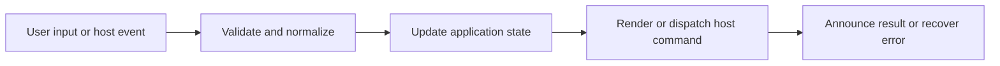

# Performance, Incremental Work, and Enhancement Scheduling

## Feature intent

Define scan/search/render responsiveness, bounded concurrency, lazy libraries, retries, cancellation, caching, and cleanup for real-world large workspaces/documents.

## Capability contract

| Capability | Required behavior | User result |
|---|---|---|
| Incremental scanning | Reveal cumulative files before full enrichment. | Large workspaces become useful sooner. |
| Bounded title reads | Limit concurrency/time/prefix bytes. | Scan cannot stall on metadata. |
| Lazy enhancements | Load syntax/math/Mermaid/chart only after base render. | Reading begins quickly. |
| Search workers/indexes | Move broad search off primary UI and cap results. | Search remains responsive. |
| Caching | Reuse conversion/index/state where valid. | Repeated operations cost less. |
| Cancellation/cleanup | Abort obsolete work and dispose resources. | No stale mutation or leaks. |

## Interaction and processing flow



### Key thresholds

| Area | Contract |
|---|---|
| Partial workspace reveal | ~3 seconds |
| Cumulative scan batch | 32 items |
| Electron title-read concurrency | 32 |
| Electron title read timeout | 250 ms |
| Electron title enrichment deadline | 1500 ms |
| Title prefix read | 8 KiB |
| Enhancement retries | 60/180/500/1000/2000 ms |
| Mermaid concurrency | 2 |
| Table concurrency | 3 |

Base content is rendered before enhancements. Every asynchronous task must have an ownership key and cleanup path.


## States and failure behavior

| State | Required presentation | Exit condition |
|---|---|---|
| Queued | Owned task not started | Run/cancel |
| Running | Bounded resource use | Done/fail/cancel |
| Retrying | Backoff delay | Run/fail |
| Done | Idempotence marker/cache | Invalidate |
| Cancelled | No result application | New task |

## Runtime behavior

| Runtime | Specification |
|---|---|
| Electron | Worker/search/scanner thresholds above. |
| Tauri | Rust bounded scan/search/converter behavior. |
| VS Code/Chromium | Incremental scanning and host-specific indexes. |
| All | Shared enhancement scheduling and cleanup. |

## Non-functional requirements

- All actions remain keyboard reachable.
- A failed enhancement must not prevent the base document from rendering.
- Host-facing inputs are validated before filesystem, shell, or network access.


## Acceptance criteria

- [ ] Base document remains interactive while optional libraries load.
- [ ] Obsolete tasks cannot apply results.
- [ ] Concurrency/size/result caps are enforced.
- [ ] Rerender/unmount disposes timers, workers, charts, and listeners.
## UI reference implementation

The sample shows the interaction boundary, not a replacement for the React implementation.

```html
<section class="spec-performance-incremental-work-and-enhancement-scheduling" aria-labelledby="performance-incremental-work-and-enhancement-scheduling-title">
  <h2 id="performance-incremental-work-and-enhancement-scheduling-title">Performance, Incremental Work, and Enhancement Scheduling</h2>
  <p data-status role="status" aria-live="polite">Ready</p>
  <button type="button" data-action>Cancel scan</button>
</section>
```

```css
.spec-performance-incremental-work-and-enhancement-scheduling {
  display: grid;
  gap: 0.75rem;
  padding: 1rem;
  border: 1px solid var(--border);
  border-radius: var(--radius, 8px);
  background: var(--surface);
  color: var(--text);
}
.spec-performance-incremental-work-and-enhancement-scheduling button:focus-visible {
  outline: 2px solid var(--accent);
  outline-offset: 2px;
}
```

```javascript
const root = document.querySelector('.spec-performance-incremental-work-and-enhancement-scheduling');
const status = root.querySelector('[data-status]');
root.querySelector('[data-action]').addEventListener('click', () => {
  window.PlatformBridge.postMessage({ command: 'cancelWorkspaceScan', workspaceOperationId: 'workspace-op-123' });
  status.textContent = 'Request sent';
});
```
## Source traceability

| Kind | Path | Purpose |
|---|---|---|
| Implementation | `ui/src/components/Content/scheduleContentEnhancements.ts` | Active behavior or contract |
| Implementation | `ui/src/components/Content/runContentEnhancements.ts` | Active behavior or contract |
| Implementation | `electron/workspace/scanner.js` | Active behavior or contract |
| Implementation | `electron/search/search-worker-controller.js` | Active behavior or contract |
| Implementation | `tauri/src/search/worker.rs` | Active behavior or contract |
| Implementation | `vscode/src/core/incrementalScan.ts` | Active behavior or contract |
| Implementation | `chromium-xtension/src/incremental-workspace-scan.ts` | Active behavior or contract |
| Verification | `tests/node/content-enhancement-races.test.mjs` | Automated expectation |
| Verification | `tests/node/content-enhancement-tasks.test.mjs` | Automated expectation |
| Verification | `tests/unit/electron/search-worker-controller.test.ts` | Automated expectation |
| Verification | `tests/unit/chromium/incremental-workspace-scan.test.ts` | Automated expectation |

---

[← Errors, Recovery, Status, and Observability](19-errors-recovery-observability.md) · [Documentation index](../README.md) · [Electron Desktop Runtime →](../04-runtimes/01-electron-desktop.md)
