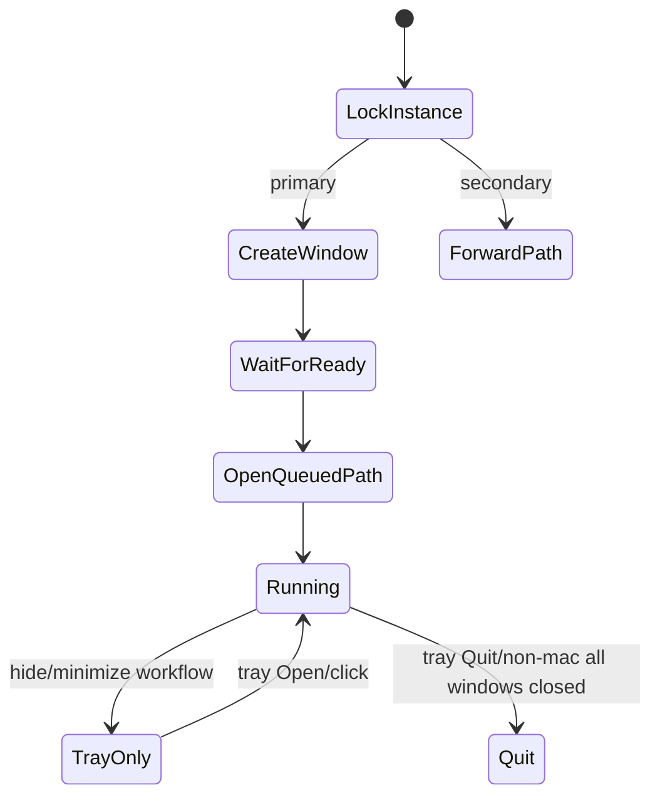

# Electron Desktop Runtime

## Responsibilities

| Service | Active modules | Contract |
|---|---|---|
| Bootstrap/lifecycle | main bootstrap/runtime/startup workspace | Single instance, window creation, ready/external path queue |
| Window/tray | window and tray services | Frameless controls, maximize/fullscreen events, Open/Quit |
| Workspace | scanner, refresh, watch, recents | Native paths, exclusions, partial batches, change detection |
| Navigation/resources | command handlers and resource reader | Render/navigation, safe local text reads |
| Search | index, worker controller, worker | Current-workspace and bounded cross-tab results |
| Conversion | document converter | Opt-in office/PDF/etc. preview |
| HTML preview | preview server | Bounded standalone local preview lifecycle |
| Update | manager/helper/state | Installed packaged Windows only; portable excluded |

## Startup and close lifecycle

## Workspace scanning rules

Ignored directories include `.git`, `node_modules`, `.vscode`, `dist`, `out`, `build`, `coverage`, `.next`, `.nuxt`, `.turbo`, `.cache`, `vendor`, `target`, `bin`, and `obj`. Root `.markdown-explorer-ignore` adds exact-name entries; comments/blank lines are ignored.

Title enrichment uses up to 32 concurrent reads, 250 ms per read, 1500 ms total enrichment deadline, and 8 KiB source prefix. Partial reveal occurs around 3 seconds with cumulative batches of 32.

## Packaging

- File associations: Markdown/MDX according to package configuration.
- Windows NSIS: per-user, assisted directory selection, Explorer integration; desktop/start-menu shortcuts are not forced by default.
- Builds include installed NSIS, portable, Windows ZIP, macOS, and Linux variants.

## Source traceability

| Kind | Path | Purpose |
|---|---|---|
| Implementation | `electron/main.js` | Active behavior or contract |
| Implementation | `electron/core/main-bootstrap.js` | Active behavior or contract |
| Implementation | `electron/core/main-runtime.js` | Active behavior or contract |
| Implementation | `electron/window/window.js` | Active behavior or contract |
| Implementation | `electron/window/tray.js` | Active behavior or contract |
| Implementation | `electron/workspace/scanner.js` | Active behavior or contract |
| Implementation | `electron/workspace/workspace-watch.js` | Active behavior or contract |
| Implementation | `electron/search/search-worker-controller.js` | Active behavior or contract |
| Implementation | `electron/render/document-converter.js` | Active behavior or contract |
| Implementation | `electron/update/update-manager.js` | Active behavior or contract |
| Implementation | `electron/build/installer.nsh` | Active behavior or contract |
| Implementation | `electron/package.json` | Active behavior or contract |
| Verification | `tests/unit/electron/main.test.ts` | Automated expectation |
| Verification | `tests/unit/electron/window.test.ts` | Automated expectation |
| Verification | `tests/unit/electron/tray.test.ts` | Automated expectation |
| Verification | `tests/unit/electron/scanner.test.ts` | Automated expectation |
| Verification | `tests/unit/electron/search-worker-controller.test.ts` | Automated expectation |
| Verification | `tests/contracts/windows-explorer-installer.test.ts` | Automated expectation |

---

[← Performance, Incremental Work, and Enhancement Scheduling](../03-features/20-performance-enhancement-scheduling.md) · [Documentation index](../README.md) · [Tauri Desktop Runtime →](02-tauri-desktop.md)
