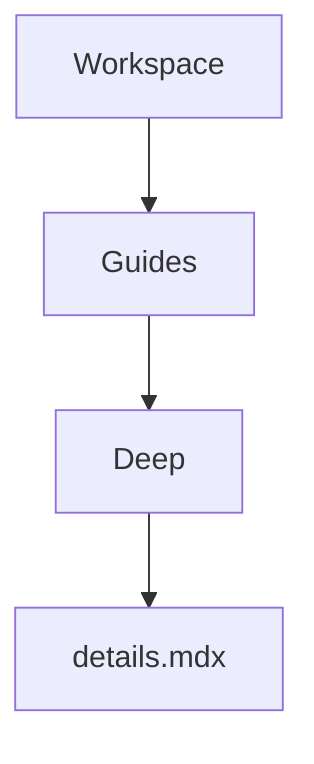

# Deep MDX Details

This `.mdx` file verifies recursive renderable-document discovery below multiple folder levels.

[Back to guide](../guide.md)

```mermaid
flowchart TD
  Workspace --> Guides
  Guides --> Deep
  Deep --> Details[details.mdx]
```
