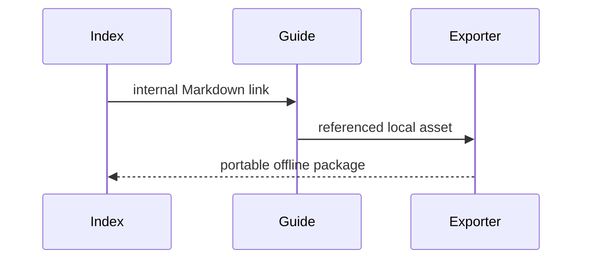

# Export Workspace Fixture

This folder is a small multi-document workspace for Whole workspace export verification.

- Open [Guide](./guides/guide.md).
- Open [Deep MDX details](./guides/deep/details.mdx).
- The image below must be packaged automatically because it is referenced by a document.
- `extras/sample.json` should only be packaged when explicitly selected under **Additional workspace files**.

