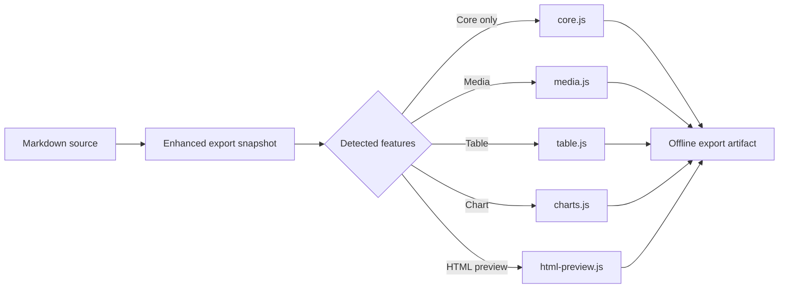

# Export Interaction Fixture

Use this file to verify standalone HTML, multi-file HTML ZIP, Static Website, and hybrid PDF export. Exported HTML must work offline and preserve only the runtime bundles needed by the content below.

## Semantic content

Ordinary headings, paragraphs, lists, links, and tables should remain normal selectable document content in PDF.

- Theme colors and typography should match the active Markdown Explorer theme.
- The exported page should own normal vertical scrolling.
- No PDF footer or Markdown Explorer branding footer should appear.

| Capability | Expected export behavior |
|---|---|
| Code | Copy and expand/collapse stay interactive in HTML |
| Mermaid | SVG remains visible and opens the media viewer |
| Image | Local image is packaged and opens the media viewer |
| HTML preview | Auto-fits its full height; authored JavaScript runs only inside the sandbox |
| CSV table | Table remains interactive and can switch to chart/chart modal |

## Long code block

```ts
export interface ExportArtifact {
  name: string;
  mimeType: string;
  bytes: Uint8Array;
}

export function describeArtifact(artifact: ExportArtifact): string {
  const lines = [
    `name=${artifact.name}`,
    `mime=${artifact.mimeType}`,
    `bytes=${artifact.bytes.byteLength}`,
    'offline=true',
    'theme=portable-snapshot',
    'runtime=feature-driven',
    'copy=enabled',
    'collapse=enabled',
    'media-viewer=conditional',
    'table-runtime=conditional',
    'chart-runtime=conditional',
    'html-preview-runtime=conditional',
    'cdn=disabled',
    'pdf-footer=removed',
    'workspace-assets=contained',
    'explicit-extras=opt-in',
    'automatic-assets=deduplicated',
    'missing-reference=warning',
    'missing-explicit-extra=failure',
    'ordinary-pdf-text=selectable',
    'complex-pdf-blocks=visual',
  ];
  return lines.join('\n');
}
```

## Mermaid media viewer



## Local image media viewer


## Tall isolated HTML preview

The complete preview should expand inline without a short internal viewport. The button must continue to work after HTML export; networking remains unavailable inside the preview sandbox.

```html
<style>
  * { box-sizing: border-box; }
  .export-preview-fixture { font: 14px/1.45 system-ui, sans-serif; padding: 16px; border: 1px solid currentColor; border-radius: 12px; }
  .export-preview-fixture button { padding: 7px 12px; cursor: pointer; }
  .export-preview-fixture li { padding: 5px 0; }
</style>
<div class="export-preview-fixture">
  <h2>Sandboxed authored script</h2>
  <p>Clicks: <strong id="fixture-count">0</strong></p>
  <button id="fixture-increment" type="button">Increment</button>
  <ol id="fixture-rows"></ol>
</div>
<script>
(() => {
  let count = 0;
  const output = document.getElementById('fixture-count');
  document.getElementById('fixture-increment').addEventListener('click', () => {
    count += 1;
    output.textContent = String(count);
  });
  const rows = document.getElementById('fixture-rows');
  for (let index = 1; index <= 24; index += 1) {
    const item = document.createElement('li');
    item.textContent = `Tall preview row ${index}: the iframe should grow to include this row.`;
    rows.appendChild(item);
  }
})();
</script>
```

## Data table and chart

```csv
Month,Electron,Tauri,VS Code,Chromium
2026-01,120,98,210,87
2026-02,134,106,224,93
2026-03,148,119,239,101
2026-04,165,127,255,112
2026-05,183,141,274,125
2026-06,201,158,296,139
```

## Workspace-package links

For a multi-folder Whole workspace test, open `manual-tests/export-workspace` as the workspace and export the entire workspace. Its `assets/export-fixture.svg` file must be packaged automatically because a document references it.

## Localization check

Switch Markdown Explorer through each supported application language (`en`, `vi`, `fr`, `es`, `zh`, `no`, `ja`, `ko`, `ru`) and reopen Export Center and Scope View. Verify that source controls, search/bulk actions, format/layout labels, export action/status text, Scope View navigation, and **Open as scope** follow the selected language. Windows installer/File Explorer verbs remain English by design because they run outside the app language context.

## Portable package-path check

On a platform that can create Windows-invalid source names, add supporting files equivalent to `con.txt`, `report.`, and `a:b?.json`, reference them from a document, and export a web package. Inspect the ZIP and confirm `_assets` contains encoded portable names: no Windows-forbidden characters, trailing dot/space, or reserved DOS device segment should remain. Confirm document links still resolve to the encoded resource paths.
