# Aurora Launch Marketing Campaign

> A comprehensive Markdown rendering stress test built around a fictional global marketing campaign.

This document intentionally combines **common Markdown**, _emphasis_, **_combined emphasis_**, ~~deprecated tactics~~, `inline code`, escaped characters such as \*literal asterisks\*, emoji 🚀, CJK text 市場投入, Vietnamese text **Chiến dịch tăng trưởng**, and long-form content.

[Campaign dashboard](https://example.com/campaign "Campaign dashboard") · <https://example.com/launch> · <marketing@example.com>

<div role="img" aria-label="Aurora campaign creative fallback" style="padding:24px;border-radius:18px;background:linear-gradient(135deg,#08111f,#18234a);color:#fff;max-width:900px">
  <strong style="font-size:1.5rem">Aurora Launch Campaign</strong><br>
  <span style="color:#cbd5e1">Self-contained HTML fallback for hosts that block data-image URLs.</span>
</div>
---

## 1. Executive Summary

The Aurora campaign introduces a new analytics platform to mid-market and enterprise buyers. The launch combines paid search, organic content, lifecycle email, webinars, partner marketing, field events, and account-based outreach.

**Primary objective:** generate **4,800 marketing-qualified leads** while maintaining blended customer acquisition cost below **$1,250**.

**North-star formula:**

$$
\mathrm{Campaign\ ROI} = \frac{\mathrm{Attributed\ Revenue} - \mathrm{Campaign\ Cost}}{\mathrm{Campaign\ Cost}} \times 100\%
$$

Inline math also matters: expected conversion is $p(\mathrm{SQL}\mid\mathrm{MQL}) = 0.28$.

> [!NOTE]
> All companies, people, URLs, and numbers in this file are fictional test data.

> [!TIP]
> Collapse and expand this section repeatedly while diagrams, formulas, and tables finish rendering.

> [!WARNING]
> A renderer must preserve the user-selected section state during asynchronous enhancement passes.

### 1.1 Campaign Goals

1. Build category awareness in priority markets.
2. Create qualified pipeline for the sales team.
3. Increase product-led trial activation.
4. Establish reusable campaign operations.

#### 1.1.1 Success Criteria

- [x] Messaging framework approved
- [x] Launch site published
- [x] Analytics taxonomy validated
- [ ] Reach 4,800 MQLs
- [ ] Reach $6.5M influenced pipeline
- [ ] Publish final campaign retrospective

##### 1.1.1.1 Measurement Notes

Metrics use a seven-day click-through window and a one-day view-through window.

###### 1.1.1.1.1 Smallest Heading

This H6 confirms deep heading rendering and section hierarchy.

---

## 2. Audience and Positioning

### 2.1 Ideal Customer Profile

- **Company size**
  - 200–5,000 employees
  - Annual revenue from $50M to $2B
- **Industries**
  - SaaS
  - Financial services
  - Retail and e-commerce
  - Professional services
- **Buying committee**
  - Chief Marketing Officer
  - VP Growth
  - Marketing Operations Director
  - Revenue Operations Lead

### 2.2 Persona Matrix

| Persona | Core Problem | Desired Outcome | Primary Objection | Preferred Proof |
|:--|:--|:--|:--|:--|
| Growth Leader | Fragmented acquisition data | Faster budget decisions | Migration risk | Revenue lift case study |
| Marketing Ops | Manual campaign reporting | Reliable automation | Integration complexity | Technical demo |
| Finance Partner | Unclear marketing efficiency | Predictable payback | Attribution confidence | Auditable model |
| Sales Leader | Low lead quality | More accepted pipeline | Marketing alignment | Shared funnel dashboard |

### 2.3 Positioning Statement

> For growth teams that need trustworthy campaign decisions, Aurora is the analytics workspace that unifies planning, activation, and attribution. Unlike disconnected dashboards, Aurora preserves one governed campaign model from budget to revenue.

### 2.4 Message Pillars

1. **One source of truth** — shared definitions, ownership, and lineage.
2. **Faster optimization** — detect underperforming spend before the month closes.
3. **Revenue confidence** — connect campaign activity to pipeline and bookings.

---

## 3. Campaign Architecture

All diagrams below use the standard `mermaid` fence. The first line inside each block selects the diagram type.

### 3.1 Campaign Flowchart

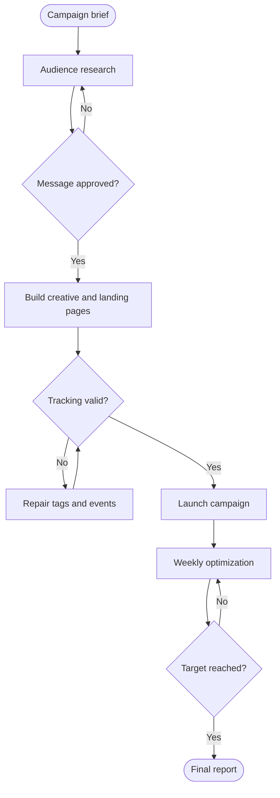

### 3.2 Campaign Mindmap

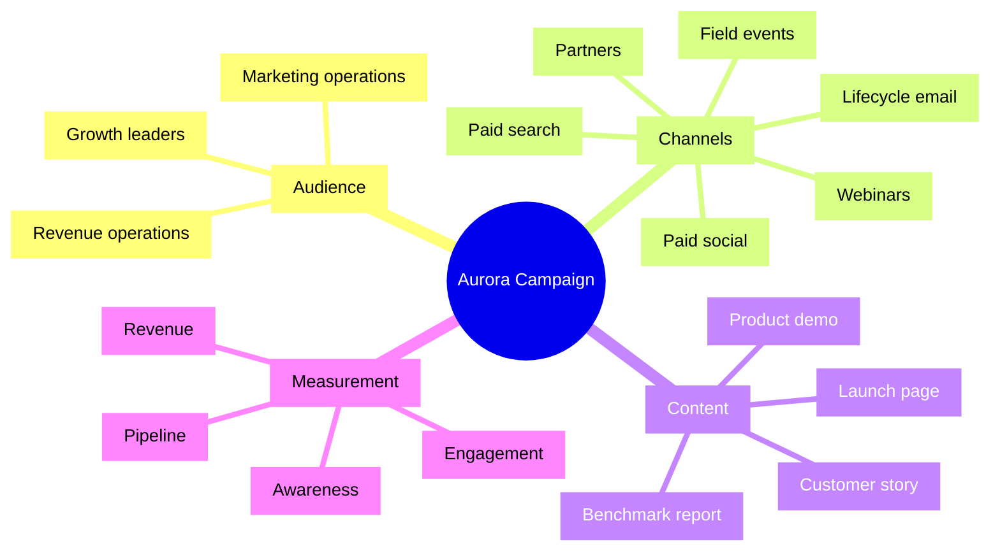

### 3.3 Lead Routing Sequence

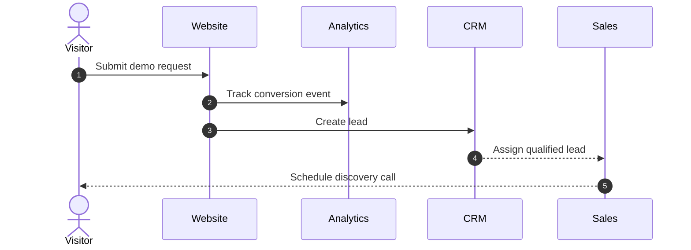

### 3.4 Launch Gantt Plan

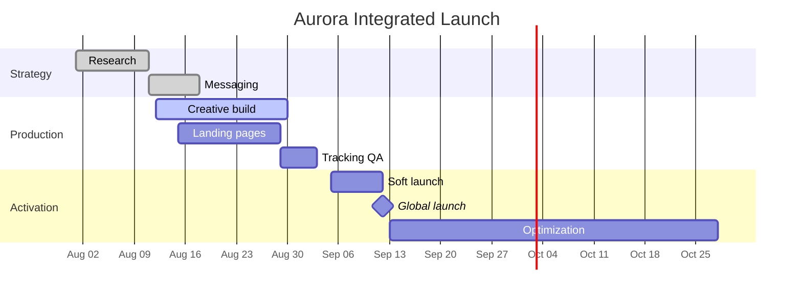

### 3.5 Enterprise Buyer Journey

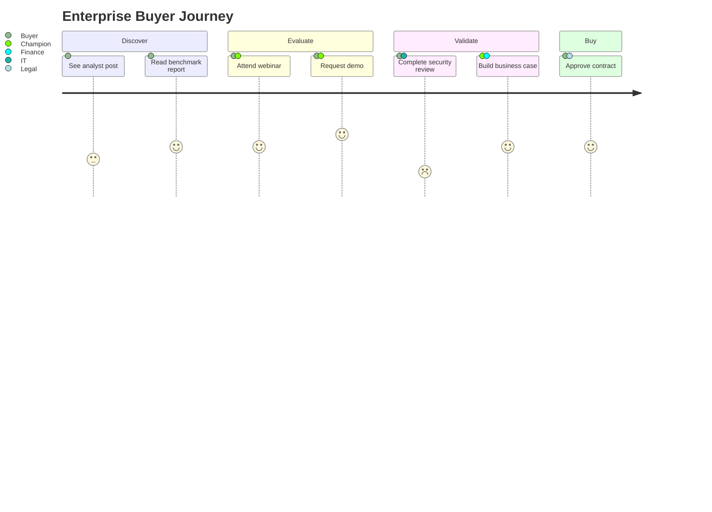

### 3.6 Lifecycle State Diagram

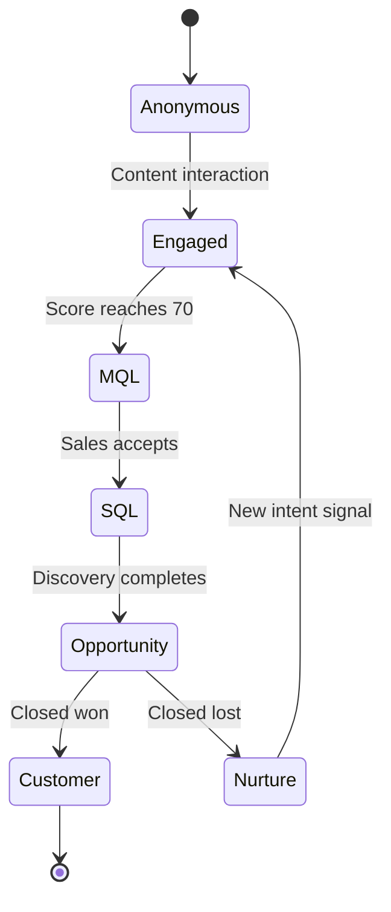

### 3.7 Campaign Data Model

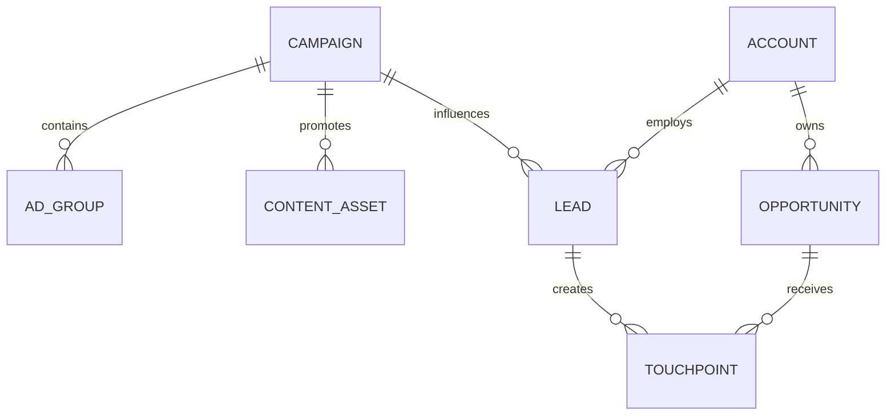

### 3.8 Campaign Domain Classes

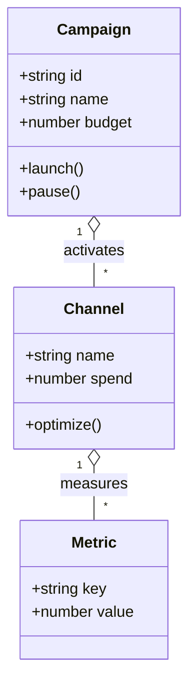

### 3.9 Planned Media Mix

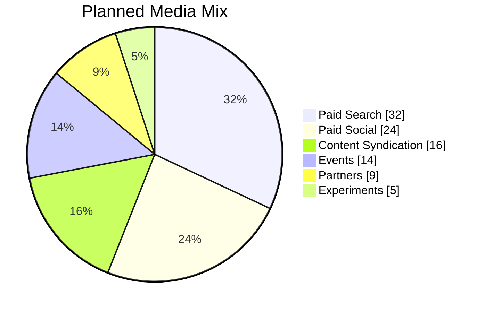

### 3.10 Launch Timeline

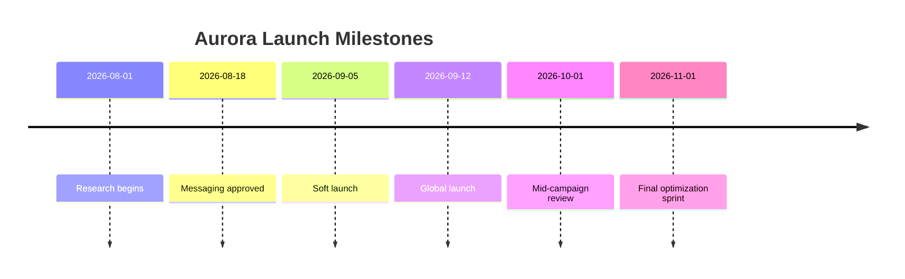

### 3.11 Channel Opportunity Matrix

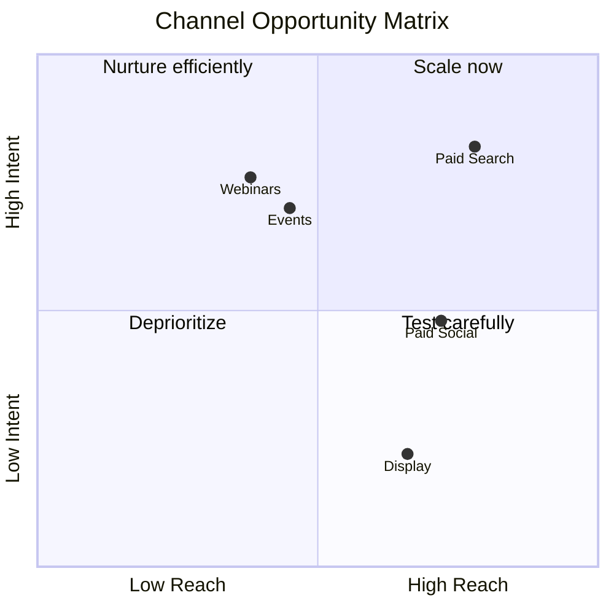

### 3.12 Weekly MQL Growth

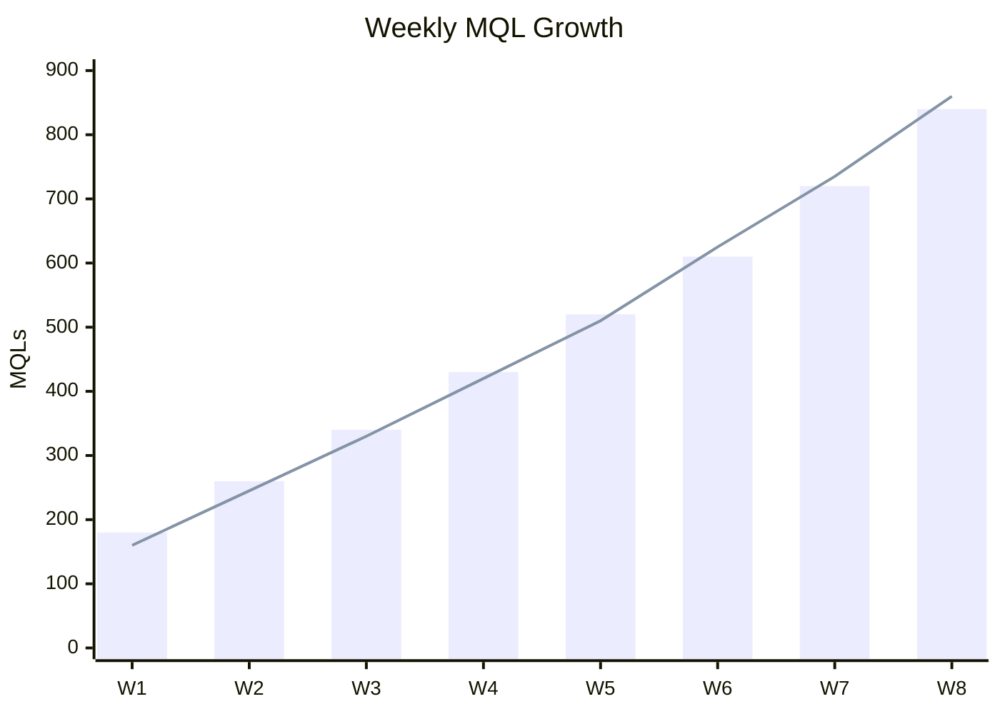

---

## 4. Budget and Performance Data

The table below intentionally includes currency symbols, commas, percentages, spaces, zero values, negative variance, and blank cells.

| Channel | Owner | Budget | Spend | Leads | MQLs | Conversion Rate | Pipeline | Variance | Status |
|:--|:--|--:|--:|--:|--:|--:|--:|--:|:--|
| Paid Search | Mina | $150,000 | $142,500 | 3,420 | 1,040 | 30.4% | $2,480,000 | $7,500 | Active |
| Paid Social | Andre | $105,000 | $98,750 | 4,810 | 820 | 17.0% | $1,560,000 | $6,250 | Active |
| Content Syndication | Priya | $72,000 | $76,400 | 1,920 | 510 | 26.6% | $980,000 | -$4,400 | Overbudget |
| Webinars | Linh | $48,000 | $41,300 | 1,180 | 430 | 36.4% | $1,220,000 | $6,700 | Active |
| Field Events | Mateo | $60,000 | $58,900 | 620 | 280 | 45.2% | $1,480,000 | $1,100 | Active |
| Partners | Zoe | $30,000 | $24,600 | 410 | 190 | 46.3% | $860,000 | $5,400 | Active |
| Experiments | Sam | $15,000 | $9,850 | 540 | 92 | 17.0% | $210,000 | $5,150 | Testing |
| Organic Content | Hana | $0 | $0 | 2,240 | 610 | 27.2% | $1,340,000 | $0 | Evergreen |
| Regional Pilot | Quang | €18,500 | €17,950 | 360 | 104 | 28.9% | €240,000 | €550 | Active |
| Vietnam Launch | Mai | ₫420,000,000 | ₫398,500,000 | 880 | 260 | 29.5% | ₫2,400,000,000 | ₫21,500,000 | Active |
| UK Roundtable | Isla | £22,000 | £20,400 | 130 | 68 | 52.3% | £410,000 | £1,600 | Complete |
| Retargeting Reserve | — | $12,000 |  |  |  |  |  |  | Planned |

### 4.1 Attribution Math

Display formula:

\[
\mathrm{CAC} = \frac{\sum_{c=1}^{m} \mathrm{Spend}_c}{\mathrm{New\ Customers}}
\]

LaTeX display formula:

$$
\mathrm{MSE} = \frac{1}{n}\sum_{i=1}^{n}\left(y_i - \hat{y}_i\right)^2
$$

TeX display formula:

$$
\mathrm{Incrementality} = \frac{Y_{\mathrm{treatment}} - Y_{\mathrm{control}}}{Y_{\mathrm{control}}}
$$

Conditional-probability formula:

$$
P\!\left(\mathrm{Purchase}\mid\mathrm{Demo}\right)
= \frac{P\!\left(\mathrm{Demo}\mid\mathrm{Purchase}\right)P\!\left(\mathrm{Purchase}\right)}
       {P\!\left(\mathrm{Demo}\right)}
$$

KaTeX-compatible constraint formula:

$$
\sum_{i=1}^{k} w_i = 1, \qquad w_i \ge 0
$$

### 4.2 KPI Definitions

| KPI | Formula | Target | Owner |
|:--|:--|--:|:--|
| Click-through rate | Clicks ÷ Impressions | 1.8% | Paid Media |
| Landing conversion | Form fills ÷ Sessions | 6.5% | Web |
| MQL rate | MQLs ÷ Leads | 28.0% | Lifecycle |
| SQL acceptance | SQLs ÷ MQLs | 55.0% | Sales Development |
| Opportunity rate | Opportunities ÷ SQLs | 32.0% | Revenue Operations |
| Pipeline ROI | Pipeline ÷ Spend | 8.0× | Finance |

---

## 5. Channel Playbooks

### 5.1 Paid Search

**Campaign groups:** brand, category, competitor, problem-aware, and solution-aware.

1. Protect exact-match brand terms.
2. Use broad match only with conversion-based bidding.
3. Add negative keywords every week.
4. Route enterprise traffic to industry-specific landing pages.

```yaml
campaign: aurora-search
market: us
objective: qualified_pipeline
daily_budget: 4800
bidding:
  strategy: target_cpa
  target: 310
tracking:
  primary_conversion: demo_request
  secondary_conversions:
    - pricing_view
    - benchmark_download
```

### 5.2 Paid Social

> “The creative must communicate one problem, one promise, and one proof point in under three seconds.”
>
> — Creative review principle

```json
{
  "campaign": "aurora-linkedin",
  "audiences": ["growth-leaders", "marketing-ops", "revops"],
  "formats": ["video", "document", "single-image"],
  "frequencyCap": 4,
  "brandSafety": true
}
```

### 5.3 Lifecycle Email

The following is a complete, responsive promotional email with scoped CSS, a hidden preheader, accessible table layout, a hero card, KPI highlights, and a mobile breakpoint.

```html
<!doctype html>
<html lang="en">
<head>
  <meta charset="utf-8">
  <meta name="viewport" content="width=device-width, initial-scale=1">
  <meta name="color-scheme" content="light dark">
  <meta name="supported-color-schemes" content="light dark">
  <title>Aurora launch briefing</title>
  <style>
    html,
    body {
      margin: 0 !important;
      padding: 0 !important;
      width: 100% !important;
      min-width: 100% !important;
      background: #eef2ff;
      font-family: Inter, Arial, Helvetica, sans-serif;
    }

    table {
      border-collapse: collapse !important;
      border-spacing: 0 !important;
    }

    img {
      display: block;
      max-width: 100%;
      height: auto;
      border: 0;
    }

    a {
      color: inherit;
    }

    .aurora-email-shell {
      width: 100%;
      background:
        radial-gradient(circle at 80% 0%, rgba(99, 102, 241, 0.28), transparent 34%),
        #eef2ff;
    }

    .aurora-email-card {
      width: 100%;
      max-width: 640px;
      overflow: hidden;
      border: 1px solid #dbe4ff;
      border-radius: 28px;
      background: #ffffff;
      box-shadow: 0 22px 60px rgba(30, 41, 59, 0.15);
    }

    .aurora-email-hero {
      padding: 52px 48px 44px;
      color: #ffffff;
      background:
        radial-gradient(circle at 88% 12%, rgba(45, 212, 191, 0.4), transparent 28%),
        linear-gradient(135deg, #0f172a 0%, #312e81 58%, #4f46e5 100%);
    }

    .aurora-email-eyebrow {
      margin: 0 0 16px;
      color: #a5f3fc;
      font-size: 12px;
      font-weight: 800;
      letter-spacing: 0.16em;
      text-transform: uppercase;
    }

    .aurora-email-title {
      margin: 0;
      font-size: 42px;
      line-height: 1.08;
      letter-spacing: -0.04em;
    }

    .aurora-email-copy {
      margin: 20px 0 0;
      color: #dbeafe;
      font-size: 18px;
      line-height: 1.65;
    }

    .aurora-email-button {
      display: inline-block;
      margin-top: 30px;
      padding: 15px 24px;
      border-radius: 999px;
      background: #ffffff;
      color: #312e81 !important;
      font-size: 16px;
      font-weight: 800;
      line-height: 1;
      text-decoration: none;
      box-shadow: 0 10px 28px rgba(15, 23, 42, 0.24);
    }

    .aurora-email-body {
      padding: 38px 48px 22px;
      color: #334155;
    }

    .aurora-email-body h2 {
      margin: 0 0 12px;
      color: #0f172a;
      font-size: 24px;
      line-height: 1.25;
    }

    .aurora-email-body p {
      margin: 0 0 18px;
      font-size: 16px;
      line-height: 1.7;
    }

    .aurora-email-stat {
      width: 33.333%;
      padding: 18px 10px;
      border: 1px solid #e2e8f0;
      background: #f8fafc;
      text-align: center;
    }

    .aurora-email-stat strong {
      display: block;
      color: #4f46e5;
      font-size: 24px;
      line-height: 1.1;
    }

    .aurora-email-stat span {
      display: block;
      margin-top: 6px;
      color: #64748b;
      font-size: 12px;
      font-weight: 700;
      letter-spacing: 0.04em;
      text-transform: uppercase;
    }

    .aurora-email-footer {
      padding: 24px 48px 36px;
      color: #64748b;
      font-size: 12px;
      line-height: 1.6;
      text-align: center;
    }

    .aurora-email-preheader {
      display: none !important;
      overflow: hidden;
      width: 0;
      height: 0;
      max-height: 0;
      max-width: 0;
      opacity: 0;
      color: transparent;
      mso-hide: all;
    }

    @media only screen and (max-width: 680px) {
      .aurora-email-card {
        border-radius: 0 !important;
      }

      .aurora-email-hero,
      .aurora-email-body,
      .aurora-email-footer {
        padding-left: 24px !important;
        padding-right: 24px !important;
      }

      .aurora-email-title {
        font-size: 34px !important;
      }

      .aurora-email-stat {
        display: block !important;
        width: auto !important;
        margin-bottom: 10px !important;
      }
    }

    @media (prefers-color-scheme: dark) {
      .aurora-email-shell {
        background: #020617 !important;
      }

      .aurora-email-card,
      .aurora-email-body {
        background: #0f172a !important;
        color: #cbd5e1 !important;
      }

      .aurora-email-body h2 {
        color: #f8fafc !important;
      }

      .aurora-email-stat {
        border-color: #334155 !important;
        background: #111827 !important;
      }
    }
  </style>
</head>
<body>
  <div class="aurora-email-preheader">
    See the campaign signals that matter before your next budget meeting.
  </div>

  <table role="presentation" class="aurora-email-shell" width="100%">
    <tr>
      <td align="center" style="padding: 34px 14px;">
        <table role="presentation" class="aurora-email-card" width="640">
          <tr>
            <td class="aurora-email-hero">
              <p class="aurora-email-eyebrow">Aurora launch briefing · September 12</p>
              <h1 class="aurora-email-title">See your campaign truth before the month closes.</h1>
              <p class="aurora-email-copy">
                Join the launch briefing to learn how growth, finance, and sales can work from one governed campaign model.
              </p>
              <a class="aurora-email-button" href="https://example.com/register">
                Reserve your seat →
              </a>
            </td>
          </tr>

          <tr>
            <td class="aurora-email-body">
              <h2>What you will learn</h2>
              <p>
                See how Aurora connects channel spend, conversion quality, pipeline, and revenue without another spreadsheet reconciliation cycle.
              </p>

              <table role="presentation" width="100%">
                <tr>
                  <td class="aurora-email-stat">
                    <strong>28%</strong>
                    <span>MQL target</span>
                  </td>
                  <td width="10"></td>
                  <td class="aurora-email-stat">
                    <strong>8×</strong>
                    <span>Pipeline ROI</span>
                  </td>
                  <td width="10"></td>
                  <td class="aurora-email-stat">
                    <strong>45 min</strong>
                    <span>Live briefing</span>
                  </td>
                </tr>
              </table>
            </td>
          </tr>

          <tr>
            <td class="aurora-email-footer">
              Aurora Analytics · 240 Market Street · San Francisco, CA 94105<br>
              <a href="https://example.com/preferences">Manage preferences</a>
              &nbsp;·&nbsp;
              <a href="https://example.com/unsubscribe">Unsubscribe</a>
            </td>
          </tr>
        </table>
      </td>
    </tr>
  </table>
</body>
</html>
```

### 5.4 Content Program

- Benchmark report
- Interactive ROI calculator
- Product comparison guide
- Customer case study
- Implementation checklist
- Executive webinar

```css
.campaign-hero {
  display: grid;
  grid-template-columns: minmax(0, 1.2fr) minmax(18rem, 0.8fr);
  gap: clamp(1rem, 4vw, 4rem);
  align-items: center;
}
```

### 5.5 Webinar Operations

```bash
#!/usr/bin/env bash
set -euo pipefail

campaign_id="aurora-launch"
export_date="2026-09-13"

printf 'Exporting registrants for %s on %s\n' "$campaign_id" "$export_date"
node scripts/export-webinar.mjs --campaign "$campaign_id" --date "$export_date"
```

### 5.6 Data Transformation

```typescript
type Touchpoint = {
  accountId: string;
  campaignId: string;
  occurredAt: string;
  value: number;
};

export function attributedPipeline(rows: readonly Touchpoint[]): number {
  return rows.reduce((total, row) => total + Math.max(0, row.value), 0);
}
```

```python
from dataclasses import dataclass
from decimal import Decimal

@dataclass(frozen=True)
class ChannelResult:
    name: str
    spend: Decimal
    pipeline: Decimal

    @property
    def roi(self) -> Decimal:
        return self.pipeline / self.spend if self.spend else Decimal("0")
```

```sql
SELECT
  campaign_id,
  SUM(spend) AS spend,
  SUM(attributed_pipeline) AS pipeline,
  SUM(attributed_pipeline) / NULLIF(SUM(spend), 0) AS pipeline_roi
FROM campaign_daily_performance
WHERE report_date BETWEEN DATE '2026-09-01' AND DATE '2026-10-31'
GROUP BY campaign_id
ORDER BY pipeline_roi DESC;
```

### 5.7 CSV Preview

```csv
channel,budget,spend,mqls,pipeline
Paid Search,150000,142500,1040,2480000
Paid Social,105000,98750,820,1560000
Webinars,48000,41300,430,1220000
Partners,30000,24600,190,860000
```

### 5.8 TSV Preview

```tsv
region	budget	mql_target	pipeline_target
North America	280000	2700	4200000
Europe	110000	1100	1600000
Asia Pacific	70000	750	950000
Latin America	20000	250	300000
```

---

## 6. Creative Review

### 6.1 Headline Variants

- “See every campaign decision in one place.”
- “Turn marketing activity into revenue confidence.”
- “Stop reconciling dashboards. Start optimizing growth.”

### 6.2 Copy Comparison

| Variant | Headline | Supporting Copy | CTA |
|:--|:--|:--|:--|
| A | Campaign truth, finally | Unify planning, spend, and attribution | Watch demo |
| B | Know what grows revenue | Find the channels creating pipeline | Explore Aurora |
| C | One model from budget to bookings | Give every team the same campaign answers | Get the report |

### 6.3 Raw HTML Components

<details>
<summary><strong>Open creative QA checklist</strong></summary>

- Logo clear space is correct.
- Text contrast passes accessibility review.
- Destination URL contains approved UTM parameters.
- Mobile crop keeps the product UI readable.

</details>

<mark>Highlighted launch message:</mark> one governed campaign model.

Keyboard review shortcut: <kbd>Ctrl</kbd> + <kbd>Shift</kbd> + <kbd>M</kbd>.

<dl>
  <dt>Impression</dt>
  <dd>An eligible ad render.</dd>
  <dt>Engaged session</dt>
  <dd>A session meeting duration or interaction criteria.</dd>
</dl>

---

## 7. Experiment Backlog

### 7.1 Hypotheses

1. **Industry landing pages** will improve enterprise form completion by at least 15%.
2. **Interactive calculators** will create higher-quality MQLs than static reports.
3. **Executive proof-led video** will lower social cost per qualified visit.

### 7.2 Experiment Table

| ID | Experiment | Audience | Primary Metric | Minimum Sample | Confidence | Decision |
|:--|:--|:--|:--|--:|--:|:--|
| EXP-001 | Benefit-led hero | All visitors | Demo conversion | 18,000 | 95% | Running |
| EXP-002 | Short form | Paid search | Form completion | 6,000 | 95% | Planned |
| EXP-003 | Customer logo strip | Enterprise | CTA click rate | 12,000 | 90% | Won |
| EXP-004 | Calculator gate | Content traffic | MQL rate | 4,500 | 95% | Inconclusive |
| EXP-005 | Webinar reminder time | Registrants | Attendance | 1,200 | 90% | Planned |

### 7.3 Statistical Notes

The approximate confidence interval for a conversion proportion is:

$$
\hat{p} \pm z_{\alpha/2}\sqrt{\frac{\hat{p}(1-\hat{p})}{n}}
$$

Do not stop an experiment because a dashboard briefly crosses significance.

---

## 8. Risk Register

| Risk | Likelihood | Impact | Early Signal | Mitigation | Owner |
|:--|:--:|:--:|:--|:--|:--|
| Tracking drift | Medium | High | Event count mismatch | Automated QA and daily reconciliation | Analytics |
| Creative fatigue | High | Medium | Frequency rises, CTR falls | Weekly creative rotation | Paid Media |
| Sales follow-up delay | Medium | High | Lead response time > 24h | Routing alerts and SLA dashboard | SDR Ops |
| Event cancellation | Low | High | Venue or travel warning | Virtual fallback format | Field Marketing |
| Budget overspend | Medium | Medium | Spend pacing > 110% | Automated pacing guardrail | Finance |
| Message inconsistency | Low | Medium | Unapproved copy variants | Central asset library | Brand |

> [!CAUTION]
> Never allow a DOM enhancement observer to overwrite user interaction state.

---

## 9. Launch Runbook

### 9.1 T-minus 7 Days

- [x] Finalize UTM taxonomy
- [x] Confirm CRM campaign IDs
- [x] Validate form routing
- [ ] Complete browser QA
- [ ] Complete mobile QA

### 9.2 Launch Day

1. Publish launch page.
2. Enable paid campaigns.
3. Send internal launch notice.
4. Verify analytics events.
5. Confirm first leads reach CRM.
6. Review spend pacing after two hours.

### 9.3 Incident Response

```text
SEVERITY 1: Forms unavailable or conversion events missing globally.
SEVERITY 2: One channel, region, or integration degraded.
SEVERITY 3: Cosmetic issue with no material conversion impact.
```

---

## 10. Weekly Performance Log

### Week 1: 2026-09-14

**Summary:** Week 1 focused on creative rotation, audience quality, and sales acceptance.

| Metric | Actual | Target | Delta |
|:--|--:|--:|--:|
| Impressions | 947,000 | 899,650 | 47,350 |
| Clicks | 16,200 | 14,904 | 1,296 |
| Leads | 493 | 458 | 35 |
| MQLs | 169 | 151 | 18 |
| Influenced pipeline | $405,000 | $315,000 | $90,000 |

- Win: message-to-market alignment improved.
- Risk: creative frequency increased in retargeting.
- Next action: refresh proof-led variants and rebalance spend.

### Week 2: 2026-09-21

**Summary:** Week 2 focused on creative rotation, audience quality, and sales acceptance.

| Metric | Actual | Target | Delta |
|:--|--:|--:|--:|
| Impressions | 1,044,000 | 991,800 | 52,200 |
| Clicks | 17,900 | 16,468 | 1,432 |
| Leads | 566 | 531 | 35 |
| MQLs | 208 | 190 | 18 |
| Influenced pipeline | $530,000 | $440,000 | $90,000 |

- Win: message-to-market alignment improved.
- Risk: creative frequency increased in retargeting.
- Next action: refresh proof-led variants and rebalance spend.

### Week 3: 2026-09-28

**Summary:** Week 3 focused on creative rotation, audience quality, and sales acceptance.

| Metric | Actual | Target | Delta |
|:--|--:|--:|--:|
| Impressions | 1,141,000 | 1,083,950 | 57,050 |
| Clicks | 19,600 | 18,032 | 1,568 |
| Leads | 639 | 604 | 35 |
| MQLs | 247 | 229 | 18 |
| Influenced pipeline | $655,000 | $565,000 | $90,000 |

- Win: message-to-market alignment improved.
- Risk: creative frequency increased in retargeting.
- Next action: refresh proof-led variants and rebalance spend.

### Week 4: 2026-10-05

**Summary:** Week 4 focused on creative rotation, audience quality, and sales acceptance.

| Metric | Actual | Target | Delta |
|:--|--:|--:|--:|
| Impressions | 1,238,000 | 1,176,100 | 61,900 |
| Clicks | 21,300 | 19,596 | 1,704 |
| Leads | 712 | 677 | 35 |
| MQLs | 286 | 268 | 18 |
| Influenced pipeline | $780,000 | $690,000 | $90,000 |

- Win: message-to-market alignment improved.
- Risk: creative frequency increased in retargeting.
- Next action: refresh proof-led variants and rebalance spend.

### Week 5: 2026-10-12

**Summary:** Week 5 focused on creative rotation, audience quality, and sales acceptance.

| Metric | Actual | Target | Delta |
|:--|--:|--:|--:|
| Impressions | 1,335,000 | 1,268,250 | 66,750 |
| Clicks | 23,000 | 21,160 | 1,840 |
| Leads | 785 | 750 | 35 |
| MQLs | 325 | 307 | 18 |
| Influenced pipeline | $905,000 | $815,000 | $90,000 |

- Win: message-to-market alignment improved.
- Risk: creative frequency increased in retargeting.
- Next action: refresh proof-led variants and rebalance spend.

### Week 6: 2026-10-19

**Summary:** Week 6 focused on creative rotation, audience quality, and sales acceptance.

| Metric | Actual | Target | Delta |
|:--|--:|--:|--:|
| Impressions | 1,432,000 | 1,360,400 | 71,600 |
| Clicks | 24,700 | 22,724 | 1,976 |
| Leads | 858 | 823 | 35 |
| MQLs | 364 | 346 | 18 |
| Influenced pipeline | $1,030,000 | $940,000 | $90,000 |

- Win: message-to-market alignment improved.
- Risk: creative frequency increased in retargeting.
- Next action: refresh proof-led variants and rebalance spend.

### Week 7: 2026-10-26

**Summary:** Week 7 focused on creative rotation, audience quality, and sales acceptance.

| Metric | Actual | Target | Delta |
|:--|--:|--:|--:|
| Impressions | 1,529,000 | 1,452,550 | 76,450 |
| Clicks | 26,400 | 24,288 | 2,112 |
| Leads | 931 | 896 | 35 |
| MQLs | 403 | 385 | 18 |
| Influenced pipeline | $1,155,000 | $1,065,000 | $90,000 |

- Win: message-to-market alignment improved.
- Risk: creative frequency increased in retargeting.
- Next action: refresh proof-led variants and rebalance spend.

### Week 8: 2026-11-02

**Summary:** Week 8 focused on creative rotation, audience quality, and sales acceptance.

| Metric | Actual | Target | Delta |
|:--|--:|--:|--:|
| Impressions | 1,626,000 | 1,544,700 | 81,300 |
| Clicks | 28,100 | 25,852 | 2,248 |
| Leads | 1,004 | 969 | 35 |
| MQLs | 442 | 424 | 18 |
| Influenced pipeline | $1,280,000 | $1,190,000 | $90,000 |

- Win: message-to-market alignment improved.
- Risk: creative frequency increased in retargeting.
- Next action: refresh proof-led variants and rebalance spend.

### Week 9: 2026-11-09

**Summary:** Week 9 focused on creative rotation, audience quality, and sales acceptance.

| Metric | Actual | Target | Delta |
|:--|--:|--:|--:|
| Impressions | 1,723,000 | 1,636,850 | 86,150 |
| Clicks | 29,800 | 27,416 | 2,384 |
| Leads | 1,077 | 1,042 | 35 |
| MQLs | 481 | 463 | 18 |
| Influenced pipeline | $1,405,000 | $1,315,000 | $90,000 |

- Win: message-to-market alignment improved.
- Risk: creative frequency increased in retargeting.
- Next action: refresh proof-led variants and rebalance spend.

### Week 10: 2026-11-16

**Summary:** Week 10 focused on creative rotation, audience quality, and sales acceptance.

| Metric | Actual | Target | Delta |
|:--|--:|--:|--:|
| Impressions | 1,820,000 | 1,729,000 | 91,000 |
| Clicks | 31,500 | 28,980 | 2,520 |
| Leads | 1,150 | 1,115 | 35 |
| MQLs | 520 | 502 | 18 |
| Influenced pipeline | $1,530,000 | $1,440,000 | $90,000 |

- Win: message-to-market alignment improved.
- Risk: creative frequency increased in retargeting.
- Next action: refresh proof-led variants and rebalance spend.

### Week 11: 2026-11-23

**Summary:** Week 11 focused on creative rotation, audience quality, and sales acceptance.

| Metric | Actual | Target | Delta |
|:--|--:|--:|--:|
| Impressions | 1,917,000 | 1,821,150 | 95,850 |
| Clicks | 33,200 | 30,544 | 2,656 |
| Leads | 1,223 | 1,188 | 35 |
| MQLs | 559 | 541 | 18 |
| Influenced pipeline | $1,655,000 | $1,565,000 | $90,000 |

- Win: message-to-market alignment improved.
- Risk: creative frequency increased in retargeting.
- Next action: refresh proof-led variants and rebalance spend.

### Week 12: 2026-11-30

**Summary:** Week 12 focused on creative rotation, audience quality, and sales acceptance.

| Metric | Actual | Target | Delta |
|:--|--:|--:|--:|
| Impressions | 2,014,000 | 1,913,300 | 100,700 |
| Clicks | 34,900 | 32,108 | 2,792 |
| Leads | 1,296 | 1,261 | 35 |
| MQLs | 598 | 580 | 18 |
| Influenced pipeline | $1,780,000 | $1,690,000 | $90,000 |

- Win: message-to-market alignment improved.
- Risk: creative frequency increased in retargeting.
- Next action: refresh proof-led variants and rebalance spend.

---

## 11. Detailed Daily Channel Data

| Date | Channel | Impressions | Clicks | Spend | Leads | MQLs | Pipeline | CTR | CPL |
|:--|:--|--:|--:|--:|--:|--:|--:|--:|--:|
| 2026-09-01 | Paid Search | 42,000 | 720 | $4,300.00 | 18 | 6 | $28,000 | 1.71% | $238.89 |
| 2026-09-02 | Paid Social | 45,100 | 803 | $4,575.00 | 22 | 8 | $37,500 | 1.78% | $207.95 |
| 2026-09-03 | Webinars | 48,200 | 886 | $4,850.00 | 26 | 10 | $47,000 | 1.84% | $186.54 |
| 2026-09-04 | Partners | 51,300 | 969 | $5,125.00 | 30 | 12 | $56,500 | 1.89% | $170.83 |
| 2026-09-05 | Content | 54,400 | 1,052 | $5,400.00 | 34 | 14 | $66,000 | 1.93% | $158.82 |
| 2026-09-06 | Events | 57,500 | 1,135 | $5,675.00 | 38 | 16 | $75,500 | 1.97% | $149.34 |
| 2026-09-07 | Paid Search | 60,600 | 1,218 | $5,950.00 | 42 | 18 | $85,000 | 2.01% | $141.67 |
| 2026-09-08 | Paid Social | 63,700 | 1,301 | $6,225.00 | 46 | 6 | $94,500 | 2.04% | $135.33 |
| 2026-09-09 | Webinars | 66,800 | 1,384 | $6,500.00 | 50 | 8 | $104,000 | 2.07% | $130.00 |
| 2026-09-10 | Partners | 69,900 | 1,467 | $6,775.00 | 18 | 10 | $113,500 | 2.10% | $376.39 |
| 2026-09-11 | Content | 73,000 | 1,550 | $7,050.00 | 22 | 12 | $123,000 | 2.12% | $320.45 |
| 2026-09-12 | Events | 76,100 | 720 | $7,325.00 | 26 | 14 | $132,500 | 0.95% | $281.73 |
| 2026-09-13 | Paid Search | 79,200 | 803 | $7,600.00 | 30 | 16 | $142,000 | 1.01% | $253.33 |
| 2026-09-14 | Paid Social | 82,300 | 886 | $4,300.00 | 34 | 18 | $151,500 | 1.08% | $126.47 |
| 2026-09-15 | Webinars | 85,400 | 969 | $4,575.00 | 38 | 6 | $161,000 | 1.13% | $120.39 |
| 2026-09-16 | Partners | 88,500 | 1,052 | $4,850.00 | 42 | 8 | $28,000 | 1.19% | $115.48 |
| 2026-09-17 | Content | 91,600 | 1,135 | $5,125.00 | 46 | 10 | $37,500 | 1.24% | $111.41 |
| 2026-09-18 | Events | 42,000 | 1,218 | $5,400.00 | 50 | 12 | $47,000 | 2.90% | $108.00 |
| 2026-09-19 | Paid Search | 45,100 | 1,301 | $5,675.00 | 18 | 14 | $56,500 | 2.88% | $315.28 |
| 2026-09-20 | Paid Social | 48,200 | 1,384 | $5,950.00 | 22 | 16 | $66,000 | 2.87% | $270.45 |
| 2026-09-21 | Webinars | 51,300 | 1,467 | $6,225.00 | 26 | 18 | $75,500 | 2.86% | $239.42 |
| 2026-09-22 | Partners | 54,400 | 1,550 | $6,500.00 | 30 | 6 | $85,000 | 2.85% | $216.67 |
| 2026-09-23 | Content | 57,500 | 720 | $6,775.00 | 34 | 8 | $94,500 | 1.25% | $199.26 |
| 2026-09-24 | Events | 60,600 | 803 | $7,050.00 | 38 | 10 | $104,000 | 1.33% | $185.53 |
| 2026-09-25 | Paid Search | 63,700 | 886 | $7,325.00 | 42 | 12 | $113,500 | 1.39% | $174.40 |
| 2026-09-26 | Paid Social | 66,800 | 969 | $7,600.00 | 46 | 14 | $123,000 | 1.45% | $165.22 |
| 2026-09-27 | Webinars | 69,900 | 1,052 | $4,300.00 | 50 | 16 | $132,500 | 1.51% | $86.00 |
| 2026-09-28 | Partners | 73,000 | 1,135 | $4,575.00 | 18 | 18 | $142,000 | 1.55% | $254.17 |
| 2026-09-29 | Content | 76,100 | 1,218 | $4,850.00 | 22 | 6 | $151,500 | 1.60% | $220.45 |
| 2026-09-30 | Events | 79,200 | 1,301 | $5,125.00 | 26 | 8 | $161,000 | 1.64% | $197.12 |
| 2026-10-01 | Paid Search | 82,300 | 1,384 | $5,400.00 | 30 | 10 | $28,000 | 1.68% | $180.00 |
| 2026-10-02 | Paid Social | 85,400 | 1,467 | $5,675.00 | 34 | 12 | $37,500 | 1.72% | $166.91 |
| 2026-10-03 | Webinars | 88,500 | 1,550 | $5,950.00 | 38 | 14 | $47,000 | 1.75% | $156.58 |
| 2026-10-04 | Partners | 91,600 | 720 | $6,225.00 | 42 | 16 | $56,500 | 0.79% | $148.21 |
| 2026-10-05 | Content | 42,000 | 803 | $6,500.00 | 46 | 18 | $66,000 | 1.91% | $141.30 |
| 2026-10-06 | Events | 45,100 | 886 | $6,775.00 | 50 | 6 | $75,500 | 1.96% | $135.50 |
| 2026-10-07 | Paid Search | 48,200 | 969 | $7,050.00 | 18 | 8 | $85,000 | 2.01% | $391.67 |
| 2026-10-08 | Paid Social | 51,300 | 1,052 | $7,325.00 | 22 | 10 | $94,500 | 2.05% | $332.95 |
| 2026-10-09 | Webinars | 54,400 | 1,135 | $7,600.00 | 26 | 12 | $104,000 | 2.09% | $292.31 |
| 2026-10-10 | Partners | 57,500 | 1,218 | $4,300.00 | 30 | 14 | $113,500 | 2.12% | $143.33 |
| 2026-10-11 | Content | 60,600 | 1,301 | $4,575.00 | 34 | 16 | $123,000 | 2.15% | $134.56 |
| 2026-10-12 | Events | 63,700 | 1,384 | $4,850.00 | 38 | 18 | $132,500 | 2.17% | $127.63 |
| 2026-10-13 | Paid Search | 66,800 | 1,467 | $5,125.00 | 42 | 6 | $142,000 | 2.20% | $122.02 |
| 2026-10-14 | Paid Social | 69,900 | 1,550 | $5,400.00 | 46 | 8 | $151,500 | 2.22% | $117.39 |
| 2026-10-15 | Webinars | 73,000 | 720 | $5,675.00 | 50 | 10 | $161,000 | 0.99% | $113.50 |
| 2026-10-16 | Partners | 76,100 | 803 | $5,950.00 | 18 | 12 | $28,000 | 1.06% | $330.56 |
| 2026-10-17 | Content | 79,200 | 886 | $6,225.00 | 22 | 14 | $37,500 | 1.12% | $282.95 |
| 2026-10-18 | Events | 82,300 | 969 | $6,500.00 | 26 | 16 | $47,000 | 1.18% | $250.00 |
| 2026-10-19 | Paid Search | 85,400 | 1,052 | $6,775.00 | 30 | 18 | $56,500 | 1.23% | $225.83 |
| 2026-10-20 | Paid Social | 88,500 | 1,135 | $7,050.00 | 34 | 6 | $66,000 | 1.28% | $207.35 |
| 2026-10-21 | Webinars | 91,600 | 1,218 | $7,325.00 | 38 | 8 | $75,500 | 1.33% | $192.76 |
| 2026-10-22 | Partners | 42,000 | 1,301 | $7,600.00 | 42 | 10 | $85,000 | 3.10% | $180.95 |
| 2026-10-23 | Content | 45,100 | 1,384 | $4,300.00 | 46 | 12 | $94,500 | 3.07% | $93.48 |
| 2026-10-24 | Events | 48,200 | 1,467 | $4,575.00 | 50 | 14 | $104,000 | 3.04% | $91.50 |
| 2026-10-25 | Paid Search | 51,300 | 1,550 | $4,850.00 | 18 | 16 | $113,500 | 3.02% | $269.44 |
| 2026-10-26 | Paid Social | 54,400 | 720 | $5,125.00 | 22 | 18 | $123,000 | 1.32% | $232.95 |
| 2026-10-27 | Webinars | 57,500 | 803 | $5,400.00 | 26 | 6 | $132,500 | 1.40% | $207.69 |
| 2026-10-28 | Partners | 60,600 | 886 | $5,675.00 | 30 | 8 | $142,000 | 1.46% | $189.17 |
| 2026-10-29 | Content | 63,700 | 969 | $5,950.00 | 34 | 10 | $151,500 | 1.52% | $175.00 |
| 2026-10-30 | Events | 66,800 | 1,052 | $6,225.00 | 38 | 12 | $161,000 | 1.57% | $163.82 |
| 2026-10-31 | Paid Search | 69,900 | 1,135 | $6,500.00 | 42 | 14 | $28,000 | 1.62% | $154.76 |
| 2026-11-01 | Paid Social | 73,000 | 1,218 | $6,775.00 | 46 | 16 | $37,500 | 1.67% | $147.28 |
| 2026-11-02 | Webinars | 76,100 | 1,301 | $7,050.00 | 50 | 18 | $47,000 | 1.71% | $141.00 |
| 2026-11-03 | Partners | 79,200 | 1,384 | $7,325.00 | 18 | 6 | $56,500 | 1.75% | $406.94 |
| 2026-11-04 | Content | 82,300 | 1,467 | $7,600.00 | 22 | 8 | $66,000 | 1.78% | $345.45 |
| 2026-11-05 | Events | 85,400 | 1,550 | $4,300.00 | 26 | 10 | $75,500 | 1.81% | $165.38 |
| 2026-11-06 | Paid Search | 88,500 | 720 | $4,575.00 | 30 | 12 | $85,000 | 0.81% | $152.50 |
| 2026-11-07 | Paid Social | 91,600 | 803 | $4,850.00 | 34 | 14 | $94,500 | 0.88% | $142.65 |
| 2026-11-08 | Webinars | 42,000 | 886 | $5,125.00 | 38 | 16 | $104,000 | 2.11% | $134.87 |
| 2026-11-09 | Partners | 45,100 | 969 | $5,400.00 | 42 | 18 | $113,500 | 2.15% | $128.57 |
| 2026-11-10 | Content | 48,200 | 1,052 | $5,675.00 | 46 | 6 | $123,000 | 2.18% | $123.37 |
| 2026-11-11 | Events | 51,300 | 1,135 | $5,950.00 | 50 | 8 | $132,500 | 2.21% | $119.00 |
| 2026-11-12 | Paid Search | 54,400 | 1,218 | $6,225.00 | 18 | 10 | $142,000 | 2.24% | $345.83 |
| 2026-11-13 | Paid Social | 57,500 | 1,301 | $6,500.00 | 22 | 12 | $151,500 | 2.26% | $295.45 |
| 2026-11-14 | Webinars | 60,600 | 1,384 | $6,775.00 | 26 | 14 | $161,000 | 2.28% | $260.58 |
| 2026-11-15 | Partners | 63,700 | 1,467 | $7,050.00 | 30 | 16 | $28,000 | 2.30% | $235.00 |
| 2026-11-16 | Content | 66,800 | 1,550 | $7,325.00 | 34 | 18 | $37,500 | 2.32% | $215.44 |
| 2026-11-17 | Events | 69,900 | 720 | $7,600.00 | 38 | 6 | $47,000 | 1.03% | $200.00 |
| 2026-11-18 | Paid Search | 73,000 | 803 | $4,300.00 | 42 | 8 | $56,500 | 1.10% | $102.38 |
| 2026-11-19 | Paid Social | 76,100 | 886 | $4,575.00 | 46 | 10 | $66,000 | 1.16% | $99.46 |
| 2026-11-20 | Webinars | 79,200 | 969 | $4,850.00 | 50 | 12 | $75,500 | 1.22% | $97.00 |
| 2026-11-21 | Partners | 82,300 | 1,052 | $5,125.00 | 18 | 14 | $85,000 | 1.28% | $284.72 |
| 2026-11-22 | Content | 85,400 | 1,135 | $5,400.00 | 22 | 16 | $94,500 | 1.33% | $245.45 |
| 2026-11-23 | Events | 88,500 | 1,218 | $5,675.00 | 26 | 18 | $104,000 | 1.38% | $218.27 |
| 2026-11-24 | Paid Search | 91,600 | 1,301 | $5,950.00 | 30 | 6 | $113,500 | 1.42% | $198.33 |
| 2026-11-25 | Paid Social | 42,000 | 1,384 | $6,225.00 | 34 | 8 | $123,000 | 3.30% | $183.09 |
| 2026-11-26 | Webinars | 45,100 | 1,467 | $6,500.00 | 38 | 10 | $132,500 | 3.25% | $171.05 |
| 2026-11-27 | Partners | 48,200 | 1,550 | $6,775.00 | 42 | 12 | $142,000 | 3.22% | $161.31 |
| 2026-11-28 | Content | 51,300 | 720 | $7,050.00 | 46 | 14 | $151,500 | 1.40% | $153.26 |
| 2026-11-29 | Events | 54,400 | 803 | $7,325.00 | 50 | 16 | $161,000 | 1.48% | $146.50 |


---

## 12. Reference Links and Footnotes

The campaign follows the [measurement framework][measurement] and the [creative system][creative].

[measurement]: https://example.com/measurement "Measurement framework"
[creative]: https://example.com/creative "Creative system"

Marketing efficiency should be reviewed with finance-approved assumptions.[^1] Multi-touch attribution is directional rather than perfectly causal.[^2]

[^1]: Finance approves the cost allocation model before launch.
[^2]: Incrementality experiments remain the strongest causal evidence available in this fictional plan.

---

## 13. Escaping and Edge Cases

Literal syntax: \# not a heading, \> not a quote, \- not a list, \`not code\`, and pipes inside code such as `channel | spend | pipeline`.

A URL with query parameters: <https://example.com/report?campaign=aurora&utm_source=docs&utm_medium=test>.

A very long campaign slug for wrapping behavior: `aurora-global-integrated-demand-generation-enterprise-analytics-platform-launch-campaign-2026-q3-master-control-group`.

Nested quote:

> Marketing asks, “What happened?”
>
> > Revenue operations asks, “What changed pipeline?”
> >
> > > Finance asks, “What should we fund next?”

Mixed nested list:

1. Strategy
   - Audience
     1. Enterprise
     2. Mid-market
   - Positioning
2. Production
   - Copy
   - Design
3. Activation
   - Paid
   - Owned
   - Earned

---

## 14. Completion Checklist

- [x] Headings H1–H6
- [x] Paragraphs and horizontal rules
- [x] Bold, italic, combined emphasis, strike-through, inline code
- [x] Links, autolinks, reference links, email links, clickable images, and a self-contained image fallback
- [x] Ordered, unordered, nested, and task lists
- [x] Blockquotes and callouts
- [x] Standard tables and large numeric data tables
- [x] Currency, percentage, negative, zero, and blank values
- [x] Code fences for text, JSON, YAML, HTML, CSS, Bash, TypeScript, Python, SQL, CSV, and TSV
- [x] Mermaid flowchart, mindmap, sequence, Gantt, journey, state, ER, class, pie, timeline, quadrant, and XY charts
- [x] Inline and display LaTeX/TeX/KaTeX using `$...$`, `$$...$$`, and `\[...\]` delimiters
- [x] Raw HTML details, mark, keyboard, and definition list elements
- [x] Unicode and escaped Markdown syntax
- [x] Footnotes and reference definitions

**End of general marketing campaign rendering test.**
