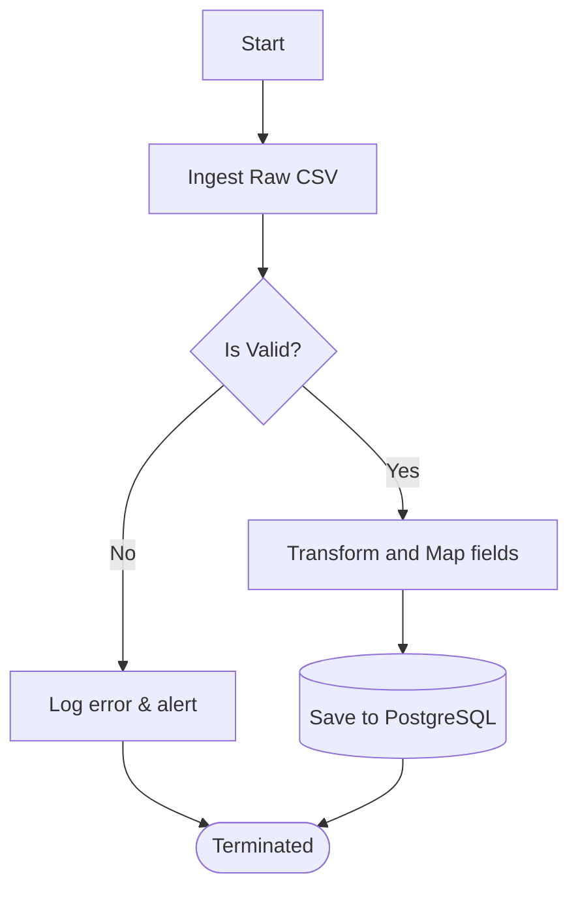
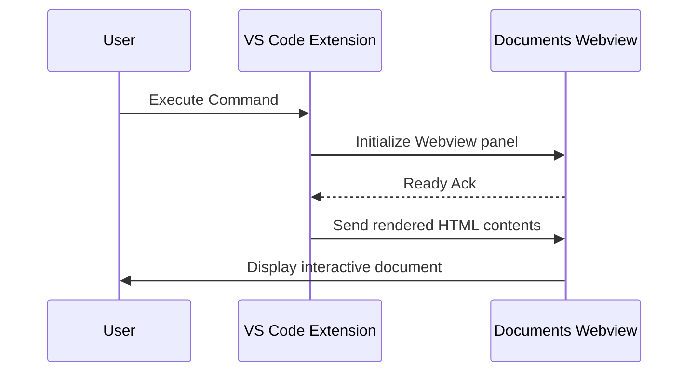
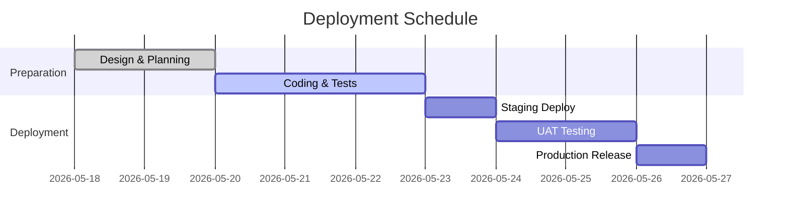

# 🧪 Test: Diagram Renderers

This document tests the integration of Mermaid.js rendering including flowcharts, sequence diagrams, class diagrams, state diagrams, and gantt charts.

---

## 1. Flowchart

---

## 2. Sequence Diagram

---

## 3. Gantt Chart

