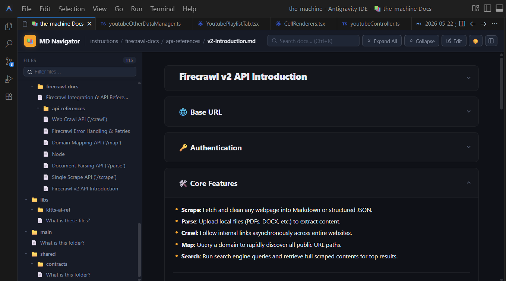

# 🧪 Test: Media & Modal Viewer

This page tests premium media handling, relative image path resolution, full-screen zoom, pan-drag capability, and navigation.

---

## Relative Image Resolution

Below are local workspace images to test responsive layout, centering, and hover zoom effect.

### Image 1: Telemetry Graph Preview

### Image 2: Workspace Architecture Design

---

## Click Interactions

1. **Zoom in/out**: Click on either image above to open the premium modal viewer. Scroll the mouse wheel or click zoom buttons.
2. **Drag-to-pan**: Click and hold to drag the zoomed image around.
3. **Carousel navigation**: While the modal is open, use left/right keyboard arrow keys or click the left/right arrows to switch between images.
